# iplanter — Journal Export

- Exported at: 2026-06-19T10:40:51Z
- Project ID: 1552
- Entries: 28

## Entry 1
- ID: 1342
- Author: vivacious_eye
- Created At: 2026-04-06T17:40:43Z

### Content

Day_1 Research on _Arduino_ and _Sensors_:
So, to begin with I first researched what is Arduino an of what importance is it to my project. I learnt that it was fast, reliable and relatively inexpensive.
Then I looked up for moisture and temp/humidity sensors online which were best suitable for my I planter project.
And I finalised these:
_Temperature and Humidity Sensor:_
DHT11
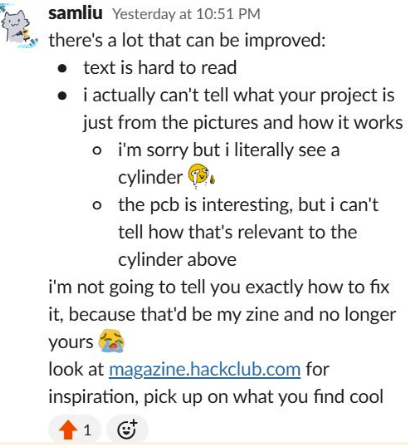
, and this:
_Capacitive Soil Misture Sensor_
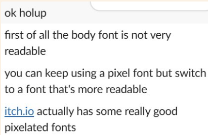

After Finalising these, obviously I searched for best boards that were compatible with these sensors and I finalised the _ESP8266 WiFi Board_
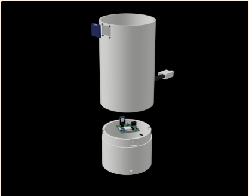

Also while researching on sensors I stumbled upon _Jumper Wires_
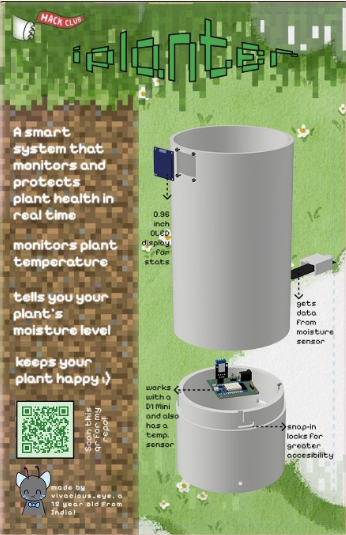

Finally these 4 are I think the main components I’m going to be needing for my project along with some coding.


### Recording Links

- https://lookout.hackclub.com/api/media/39c8e9b1-5498-4592-938e-7a8112fe8d25/video.mp4

## Entry 2
- ID: 1422
- Author: vivacious_eye
- Created At: 2026-04-07T18:30:29Z

### Content

day_2
Soooo.., today I researched a bit more about my components; how they work etc etc. I checked their compatibility with my Board.
As I speak of the board I came to know that ESP8266 is just a library and other boards like_ D1 Mini _etc run on them. So, I re-picked _D1 Mini _as my main board.

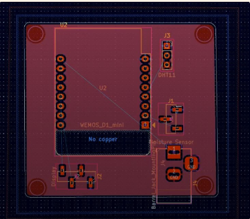

As I researched more on the pinout diagrams for my components I found out that the _VCC pin = +ve_ and _GND_ is always _-ve. _
I searched up the wirings to connect the soil sensor and dht11 to d1 mini. I didn't have the space or time to note it in neatly so I drafted a rough copy in the Notepad:

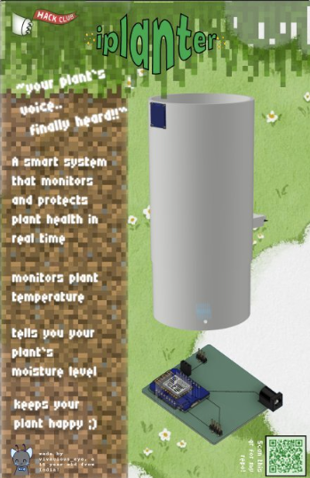

Not super clean but works for now.
Next I went on to research a little about _KiCAD_ as it was the recommended pcb designing software. I learnt that you can import designs from kicad to _blender_ for a more nicer appeal of the pcb.


### Recording Links

- https://lookout.hackclub.com/api/media/a0194fdb-2934-48bc-9faa-4f39b76ea9d6/video.mp4

## Entry 3
- ID: 1499
- Author: vivacious_eye
- Created At: 2026-04-08T17:53:08Z

### Content

**day_3
**Today I did some editing to the README file in git and I need to add images and files of my designs to it. Then while I was typing "_OLED diplay..._" I remembered that I hadn't known the pinout for the_ display to d1 mini_ so I searched that up and logged it too!!

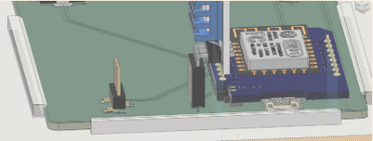

Then I thought of making some of the schematic for my pcb but it went **haywireee!!**
At first it was going great, I imported the d1 mini and dht11 to the schematic and wired it up neatly. When I went to find the Moisture Sensor it wasn't there in the library. 
Then when I googled it and glanced at a yt vid I gtk that we had to manually make the sensor in the schematic in KiCAD, 

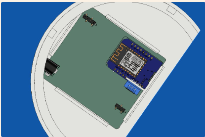

So, I thought we will see about that later and as I was going to take a look at my design in pcb mode...** BOOM** it vanished. 
All the imports were gone and the page was clean.

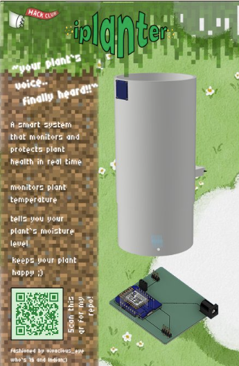

Then I closed today's sess thinking I'll see it tomorrow


### Recording Links

- https://lookout.hackclub.com/api/media/017bf1f2-2a90-4ec8-a157-3f55615da24c/video.mp4

## Entry 4
- ID: 1658
- Author: vivacious_eye
- Created At: 2026-04-10T15:27:24Z

### Content

day_4
Yayyy!! today I fixed most of the issues that had happened yesterday:
The kicad file that got deleted yesterday, guess what I rebuilt it with the soil sensor (sorta;))..

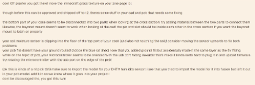

For the sensor what I actually did was I just placed three pin headers and named them VCC, GND and AOUT, as kicad didn't have a component called soil sensor I had to _make it manually. _

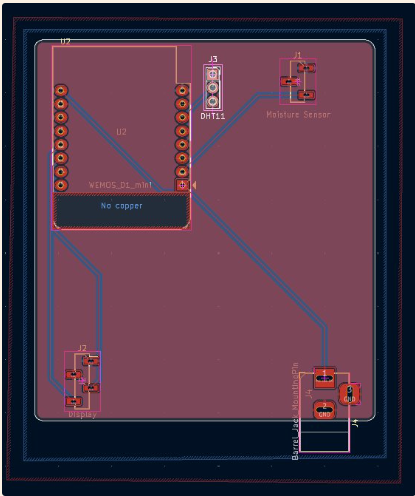

Boy I had to a lot of research to make all this.
As usual I hit another problem on the way. _The pin headers and their wirings were not visible in the pcb view. _

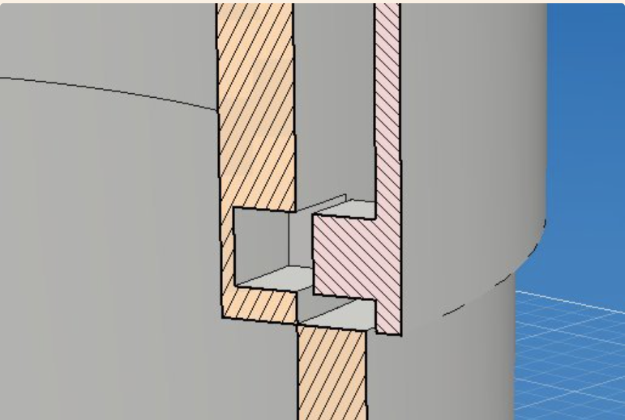

I thought I will fix that later and went on to commit the schematics to my git repo
Also when I tried to render the 3D view it was incomplete and I was just seeing blocks (literally lol!!)
 
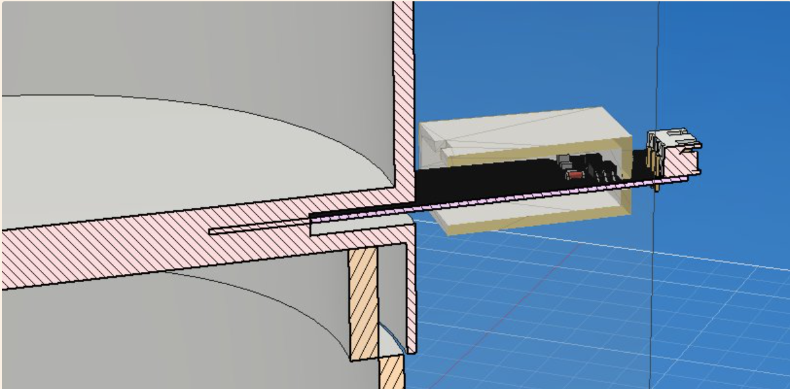

I gtk that I had to download the _3d models of the components from SNAPMAGIC!!_
After this I ended my sesh with _mixed feelings hehe.._

### Recording Links

- https://lookout.hackclub.com/api/media/73044bc6-2b32-4cab-95aa-356b489d5356/video.mp4

## Entry 5
- ID: 1677
- Author: vivacious_eye
- Created At: 2026-04-10T18:59:39Z

### Content

**day_4**
So today was a _rollercosterr!!!_
I wanted get some coding done today so I started by coding in the moisture sensor part first.
And for the first time, it was successful!!

Next, I went for the whole code which contained all the things - code for dht11, moisture sensor (I am yet to code the LED display cause its hard :( and I want to code a ui for it).

I defined dht11 sensor and went for the code, which took a long time - like about a _half hour (that may be les to you but as a student its equivalent to a day’s hw hehe :). _
Even though I had invested so much energy into _it, it displayed two errors, right when I had like only 2 bran cells (tired cause i usually work at the end of the day):_

```
expected ‘;’
```

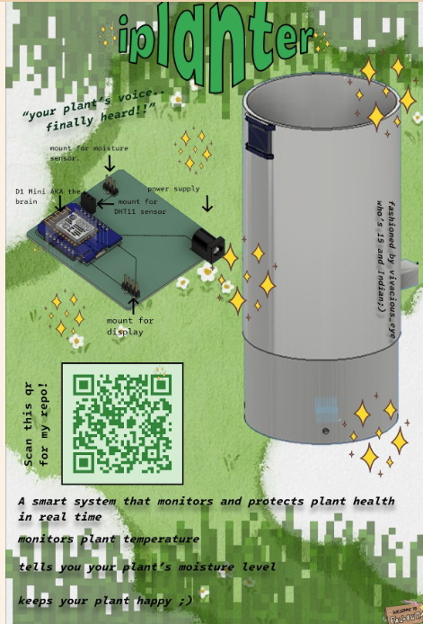

```
‘Setup’ not defined:
```

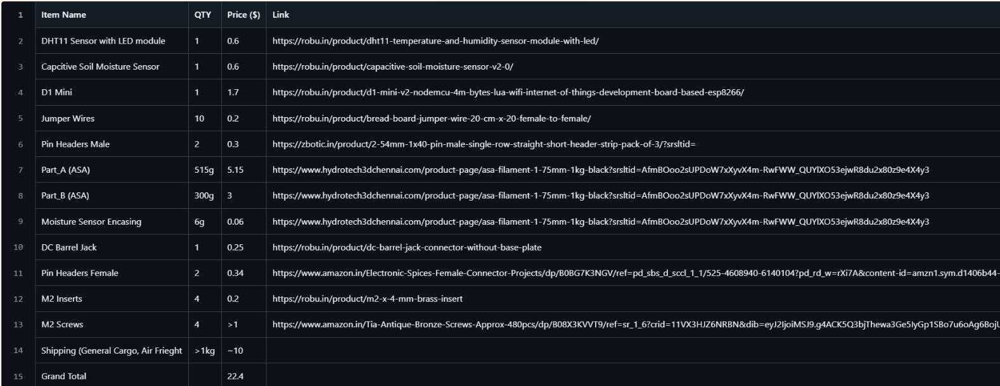
Smth like this ^

So, I used a lil’ a lil’ 🤏 google to research about the errors.
Then happily I fixed them in like 5 mins (not the useual 1 hr debug thankfully😭)

Only then I had finally _received this:_

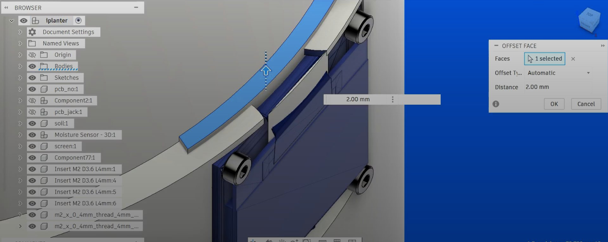

So, I was happy to end my coding sesh and upload a lil of those files not my git repo, calmly ending the session with little research on BOM…


### Recording Links

- https://lookout.hackclub.com/api/media/ab37e3ce-869a-41e6-bcbc-273c83643db6/video.mp4

## Entry 6
- ID: 1791
- Author: vivacious_eye
- Created At: 2026-04-11T17:40:42Z

### Content

**day_5**
Yo today was the _real deall!!_
Today I got so much of work done. First I added the code for my  _OLED display_  which I had forgot :)).

After that I went on to install the component models(3d) from **snapmagic** -_ it didnt go well.._
Every time I tried to download a model it showed this annoying _white pop up and it just stopped there:_

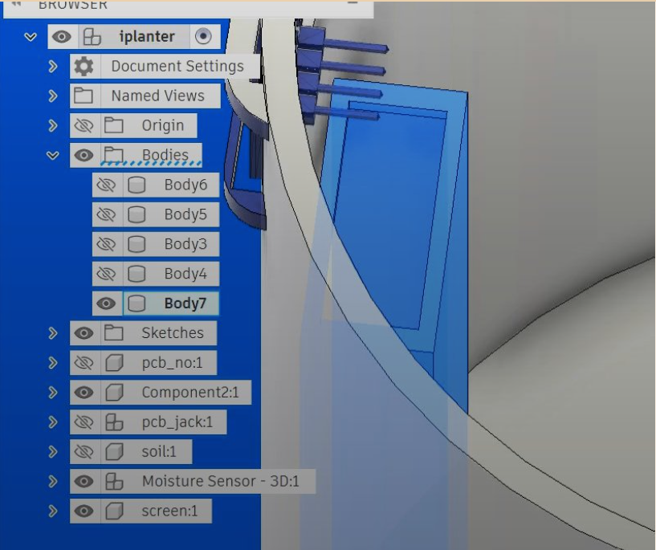

Sooo, _I had to use sketchfab for the models_
After that I sucessfully changed the _3d model dir_ to the files which I had downloaded.
And it was succesful!!

When I tried to check if all the files had rendered, the display_ one had a green overlay on it:_

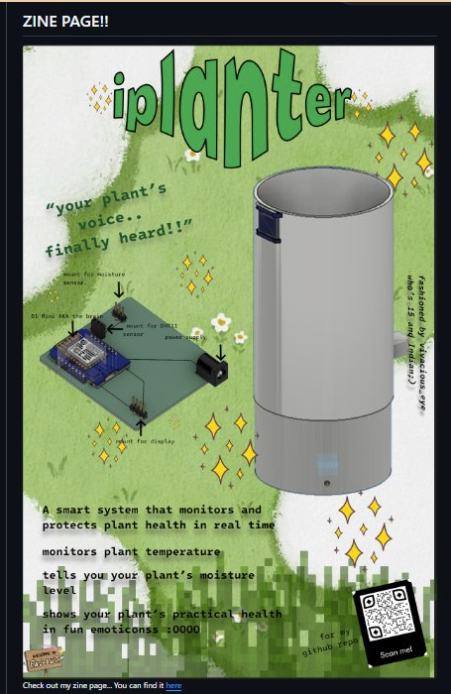

As annnoying as it sounds, I later found out that it was_ just showing the selected object.... uhhhhhh😫_

After I had completed this, surely I had to document it so_ I added the necessary files and folder to my git repo:_

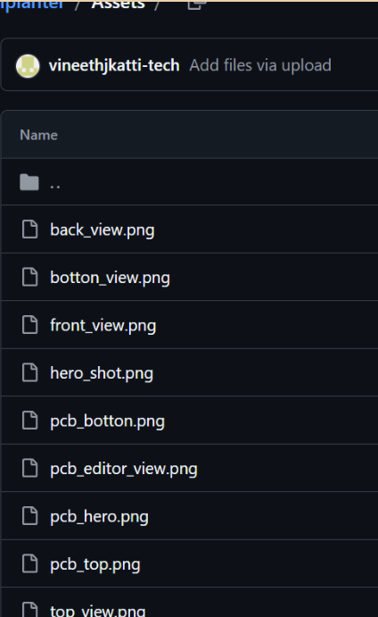
**Note:**_ adding folders was soooo hardd!!_

Then I continued to search and download a _nyc planter model from grabcad_

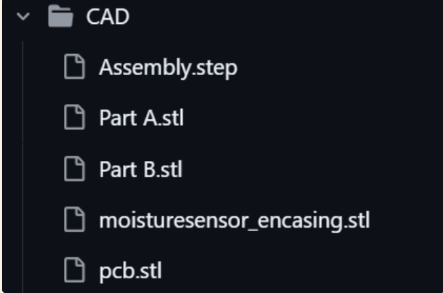

I feel today was the_ most productive_ of all the days!!
so _UNTIL WE MEET AGAIN.._


### Recording Links

- https://lookout.hackclub.com/api/media/a42e9739-10e7-48d4-97ff-4ad5316751c7/video.mp4
- https://lookout.hackclub.com/api/media/274ed63b-8791-4bec-a9bc-25bfed9e1fe9/video.mp4

## Entry 7
- ID: 1938
- Author: vivacious_eye
- Created At: 2026-04-12T18:38:37Z

### Content

**day_6**
Yooo today was genuinely _exhausting..._
Today I designed the pcb and pot assembly.
To give a brief idea the pcb has to sit in the pot and except the display the rest of the pcb should have an enclosing:
The X-Ray looks like this:

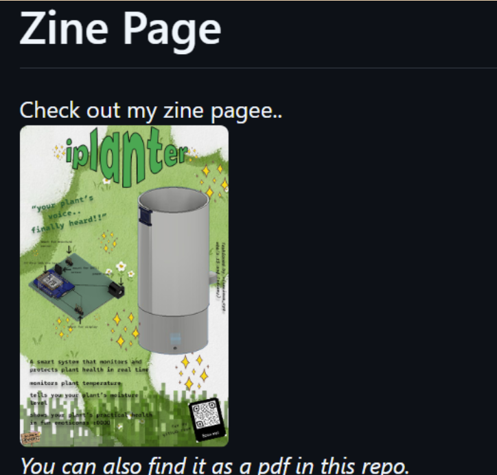

**The Process:**
First I had to make a hole in the pot so the display is _visible.._

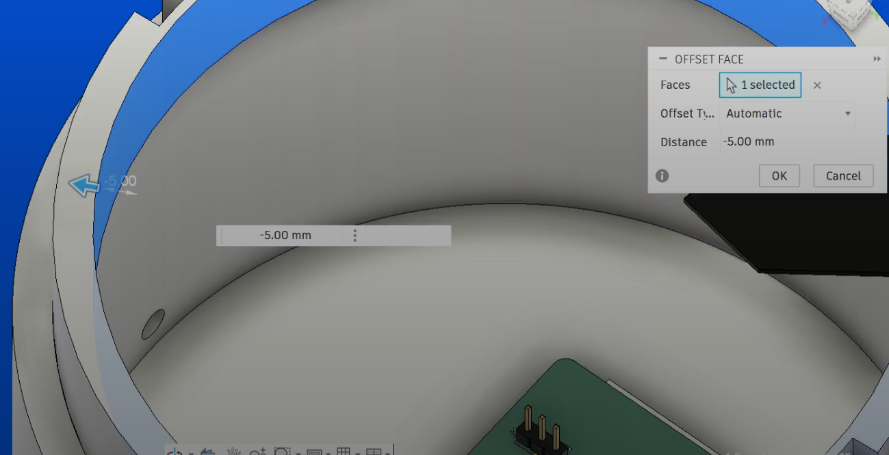
_This was relatively easier than the rest of the designing but still a noticeable learning curve.._

Next was making fitting the pcb in.. I did it and the display was visible in the window but a little of the board was visible outside..
_So, I had to edit it so that the display was at the edge of the board:_

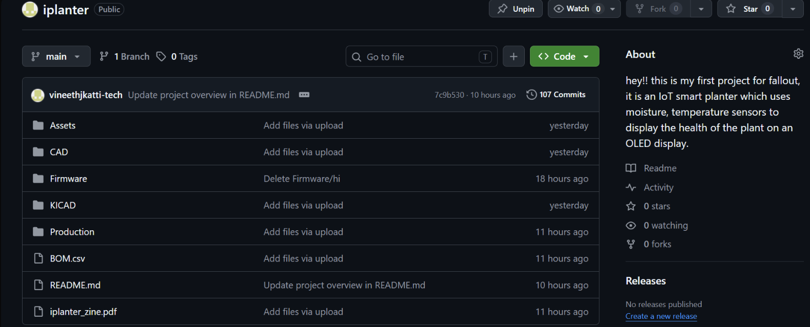

Then the display was_ out and the pcb was insideee just just like I wanted 😮‍💨😮‍💨😮‍💨..._

After that I had to make a casing for it so I imported a cube and scaled it so it roughly matched the size of the rest of the pcb but larger. 
As I tried to increase the wall thickness (with _"solidify"_ modifier) the thickness went_ haywireeee..._

The cube extended from everywhere: inside outside everywhere. So, then I realised I had to scale it and adjust the offset..

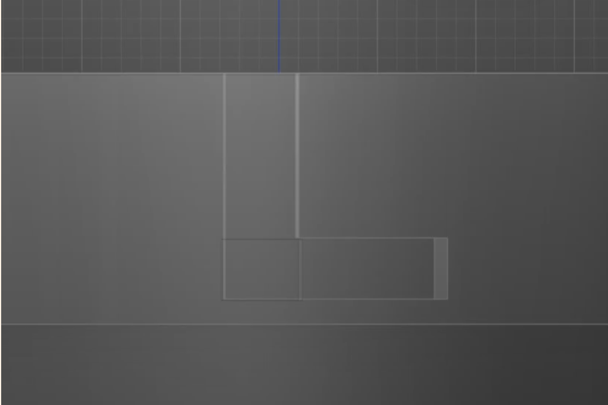
_1 means outside and -1 means inside.._

And after that everything was complete:

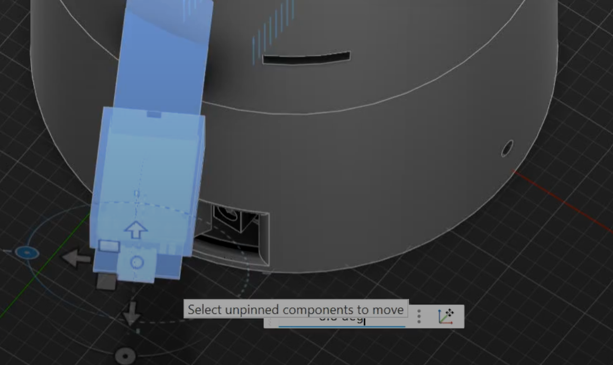
_complete!!!_

All that was left that was _adding it into git repo.._

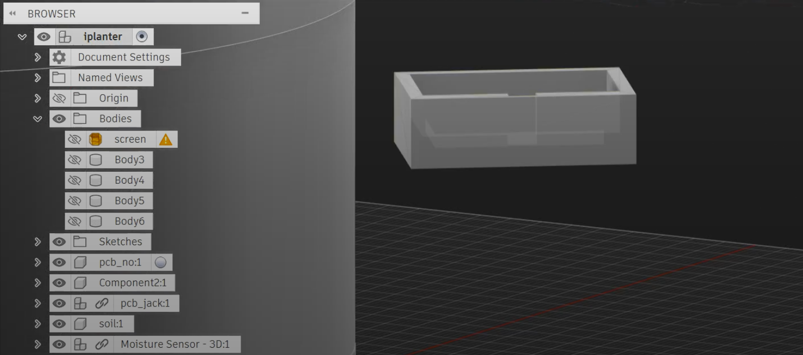
_
This was my today's routineeee yayyy!!!_


### Recording Links

- https://lookout.hackclub.com/api/media/8740155c-8126-4273-8aa6-d9e91134e4eb/video.mp4

## Entry 8
- ID: 2323
- Author: vivacious_eye
- Created At: 2026-04-15T11:59:02Z

### Content

### day_7 and day_8
I'm writing two days of journal todya cause I didn't get timee soo what happened was:
I first got into the zine page. I created a page in Figma and I thought of putting a render image of my project as the hero of my poster.
I thought it would be easy as I had seen the _render_ button before but blender proved me wrong:

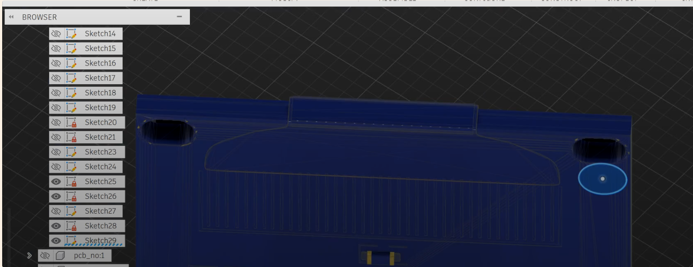
_All I saw was a blank screen!!_

Only when I researched on google that I got to know that the _camera_ and _light_ elements are useful in rendering the image.
So, I spent like an hour setting up the camera and lighting:

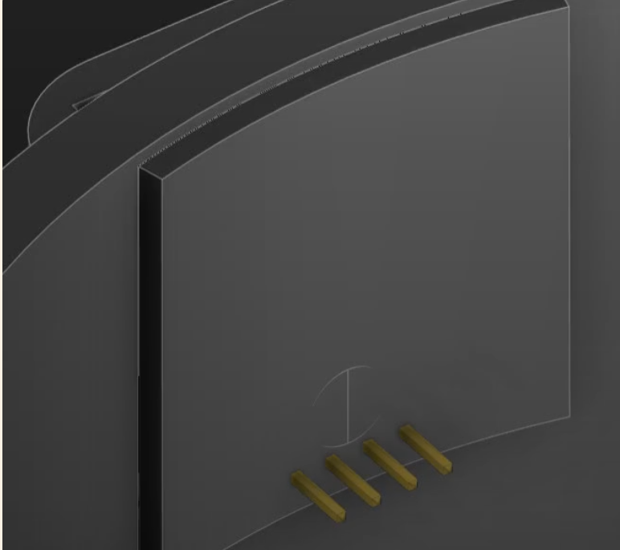
_Yk after setting everything up I found out that there was no colour to the pot and pcb!_

Then I ragequit blender and opened spline in web -- _which was sooo better.. (sorry blender :(_
It took like 1- sec to change the color and I even added a placeholder plant it and it looked soo good..:

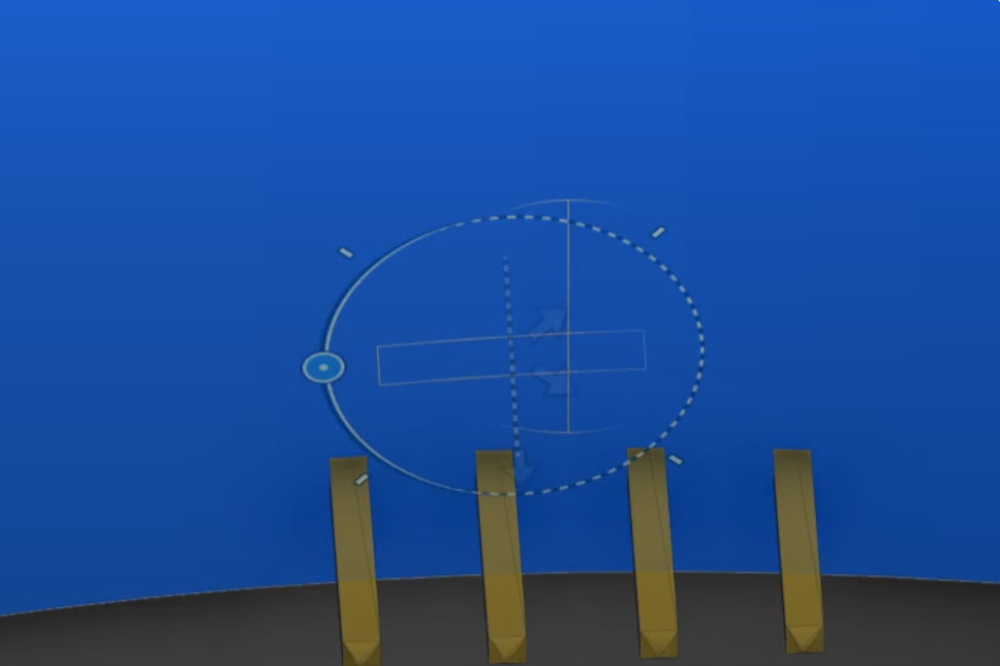

Then I got a ss of the pcb and placed in my zine page. It was looking mid at that time:

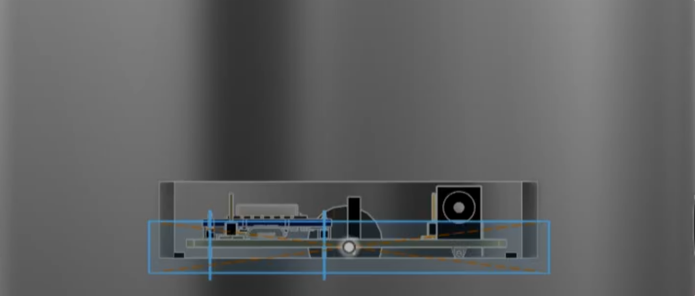

Then I thought of some catchphrases to add and also I put the previously rendered image of the pot into it too (obv cause it was like my whole project..)
I also changed the bg colors but I didn't remove the grainy texture.. _it looked goodd_
SO, this is how my zine page ended up:

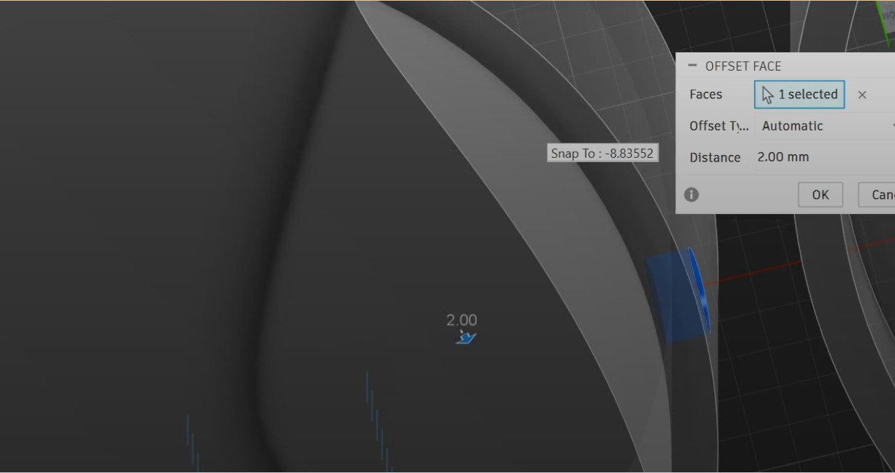
_It looked even good with the river bg and the glow behind the pot!!_

After that I started to create and edit a BOM file for my project and that is when my computer shutdown..... sad.
But, We are nearing to our design's end so that's a _win_.

### Recording Links

- https://lookout.hackclub.com/api/media/71029e5e-effa-463b-9a8b-f3017571bad6/video.mp4

## Entry 9
- ID: 2472
- Author: vivacious_eye
- Created At: 2026-04-16T18:26:53Z

### Content

### day_9
Today was one of the worst days of this project.....
Lets start with the good things.
I started where I left of and started editing my BOM file.:

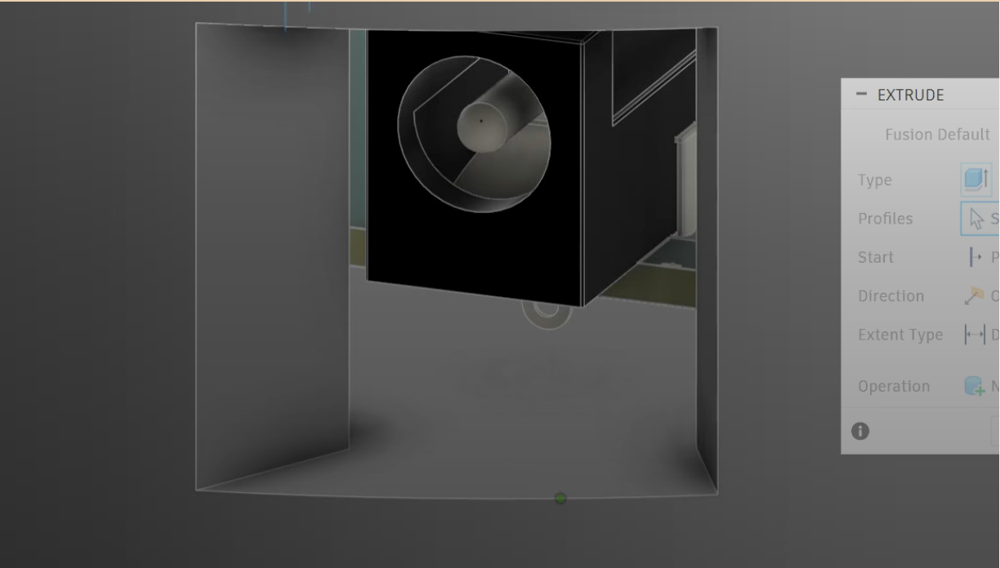
_it was slowly coming together!!_

And then I completed it even though I didn't know if it was right or not and uploaded it to git:

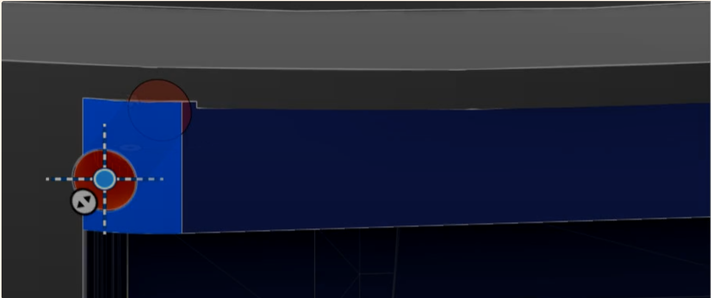
_it looks soo good (for me atleast )_

After that I decided to check out my design once again. Then I realised that we were supposed to also add a plausible assembly method -- nuh uh my project was joined together by hopes (totally the opp to what the guide says) I was absolutely devastated and didn't know what to do. 

Here is me trying to figure something out:
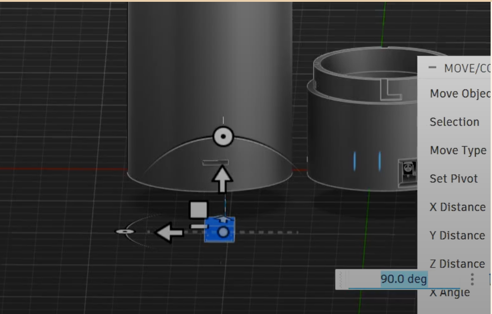
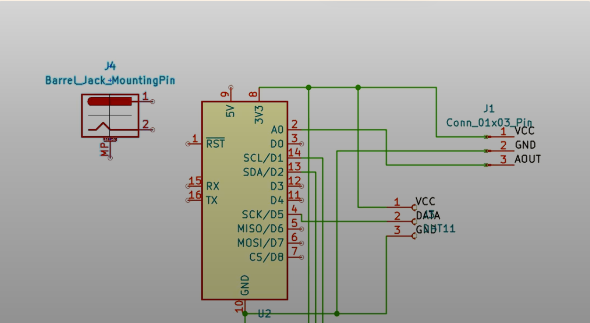
_I was so desperate cause I thought I would submit it todayy :(((_

But, then I accepted defeat and logged out for the day hoping to come back with some _brainstorming next day!!_


### Recording Links

- https://lookout.hackclub.com/api/media/17dc161d-d8e9-436a-915d-6026b2336c81/video.mp4

## Entry 10
- ID: 2577
- Author: vivacious_eye
- Created At: 2026-04-17T16:03:22Z

### Content

** day_10**
Yo yo yoooo!! _today was productive I can sayy!!_
I started by using _Fusion_ to import the pcb and get to work.


_fusion looks so upper classyyy_

I started by scaling the pcb down to IRL measurments.
Then I tried to make a cylinder but ended up messing it:


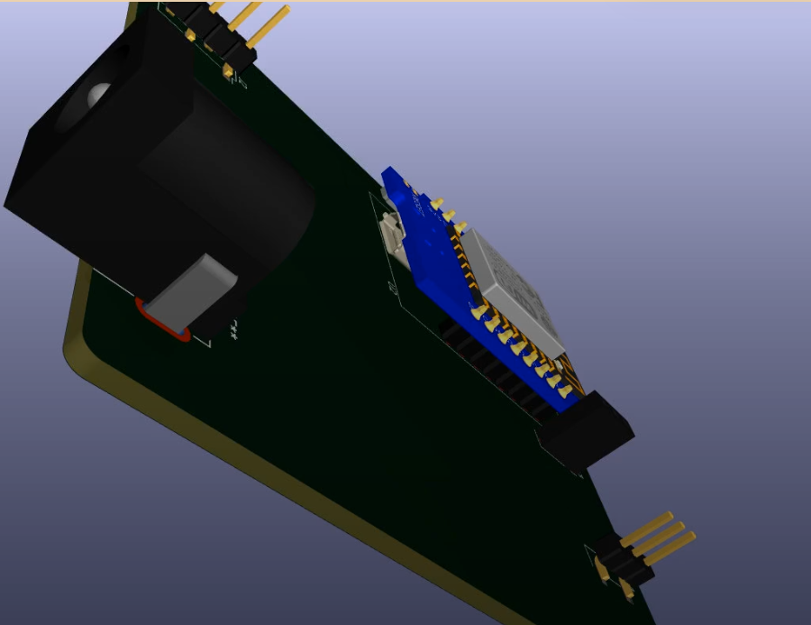
_I actually had to make a circle, extrude and then extrude another circle of lesser diameter into the previous circle and cut it or smth like that_

Then After seeing some tutorials I got the hang of it:


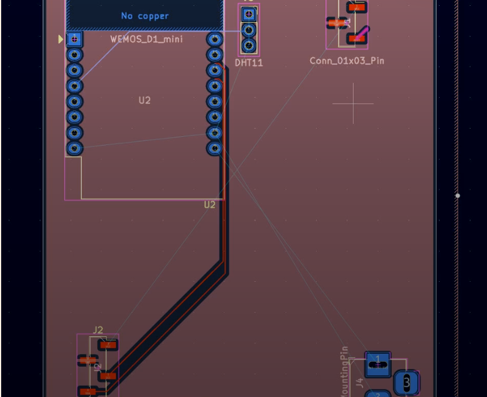
_I had put the pcb inside it_

Next I had to import the stl file of dht11 into fusion which took a lot of time and was annoying - why cause I couldn't find any stl files of it and I downloaded it and I used a CONVERTER literally:


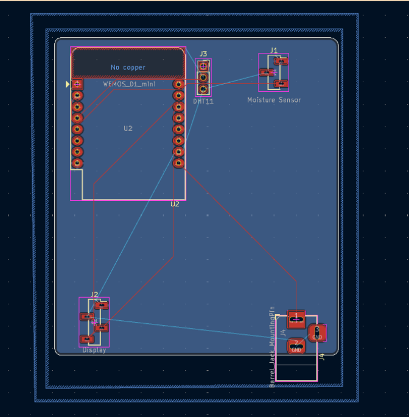
_I was so annoyed at this pointt uhhh 😫_

Then I finally imported it but gues what? It was tooo small to see:

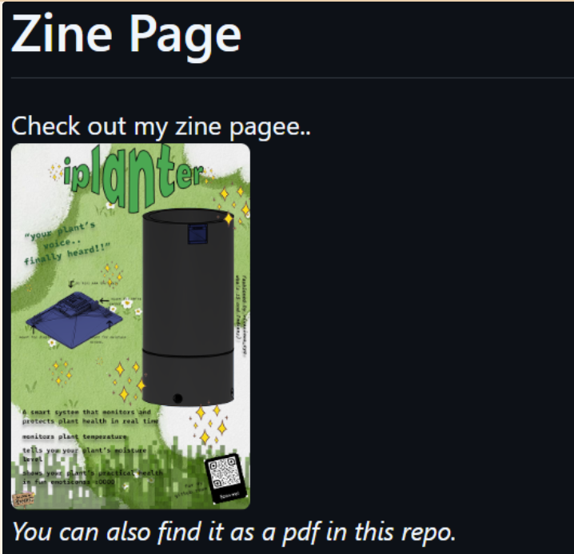
_I had to zoom in like 100x to see this_

Then I scaled it and finally put it into the cylinder and also made a hole to it (Ill tell why later):

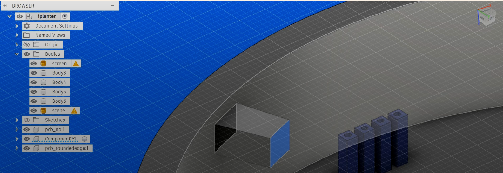

Also here is a litlle scribble I did for my new design (I don't know if anyone will understand it but try):

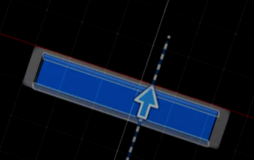
_I'll be adding designs from this scribble in my later journals soo take a hintt_

Thats all for today byeee!!


### Recording Links

- https://lookout.hackclub.com/api/media/d695003b-a4f2-40d3-bc00-90b1c24fa4c6/video.mp4

## Entry 11
- ID: 2748
- Author: vivacious_eye
- Created At: 2026-04-18T18:05:56Z

### Content

**day_11**
Today was kind of good, kinda badd but I can say it was a happy ending:
I first started of to make holes at the base of the part..

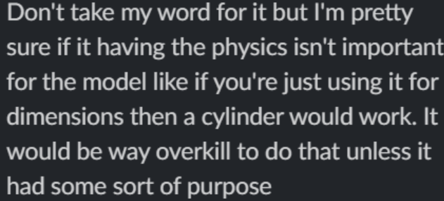
But it wasn't letting me choose the faces.

Then I found out that the object I was designing somehow was linked with a component:

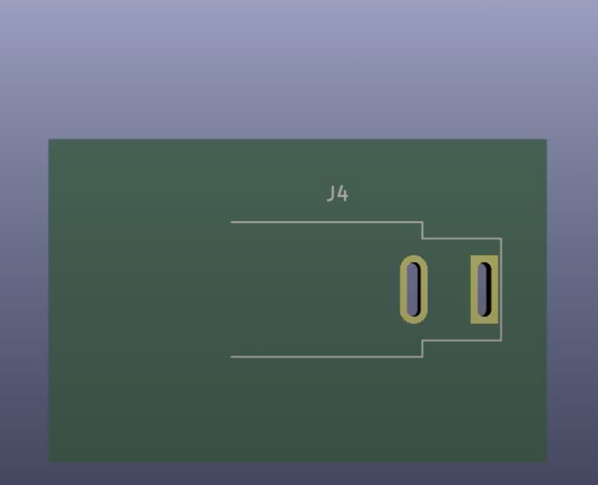

I looked it up on google and it told to unlink them. Then I went forward and unlinked the but it deleted the whole project.

Then I had to redo the whole project again. It was easy cause I already knew everything. 
At last everything turned out to be good and today's work looks like this:

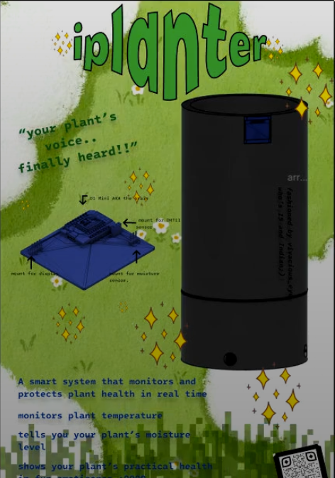

Thats it for today cause I was short on time todayy byeee!!


### Recording Links

- https://lookout.hackclub.com/api/media/e8717182-92d7-46c3-8b2d-ea1cfd6adc78/video.mp4

## Entry 12
- ID: 2918
- Author: vivacious_eye
- Created At: 2026-04-19T17:45:37Z

### Content

**day_12**
Today was like a sort of revival day..
Today i revived my model and made it work again:
I first edited my KiCAD pcb design to match IRL dimensions:

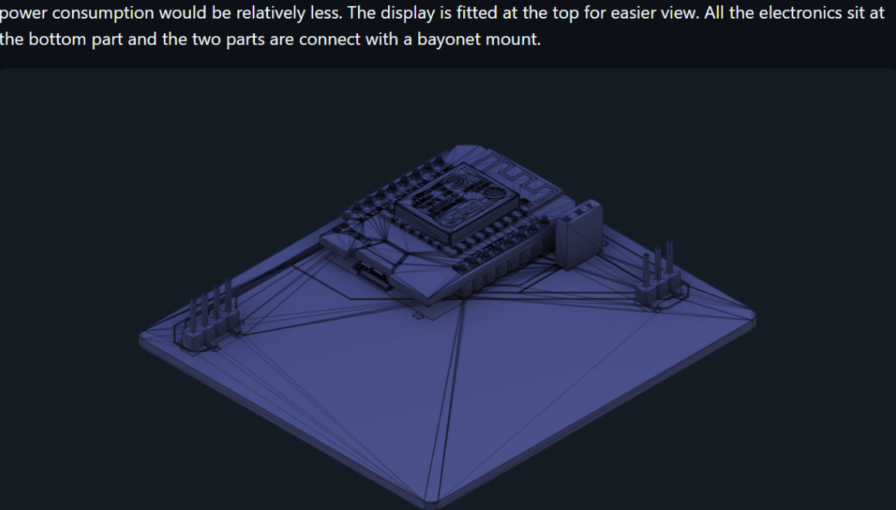
_scaled it to 6x6mm, had to some tuff calculations_

Next I tried to scale the 3d model but it kept distorting idk why:

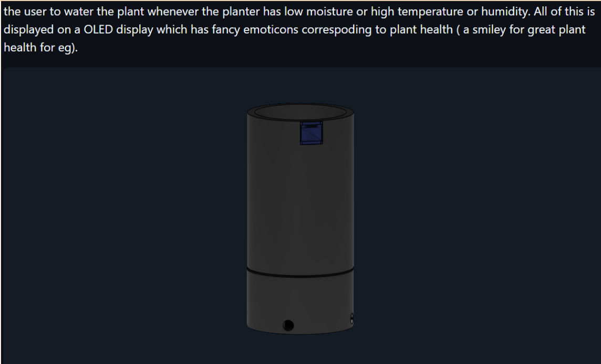
_I heard it was due to some component linking stuff_

Then I left it and undoed all the changes and started working on the pot part. I closed the pot from one side. and then imported the display which was _again too small to see_ so I scaled it:

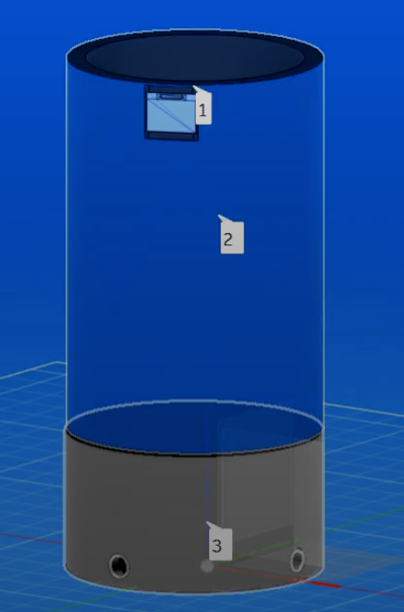
_it was so annoying everytime this happened_

After positioning it I did some complicated cutting to fit it inside the pot part:

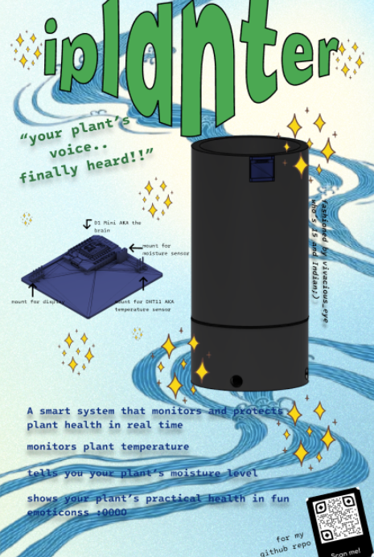
_I complicated it even though there was an easier way, but I just began using fusion so I think this is pretty good for a beginner_

After having fitted the display inside the pot I made a hole through the enclosed part of the pot for the moisture sensor:

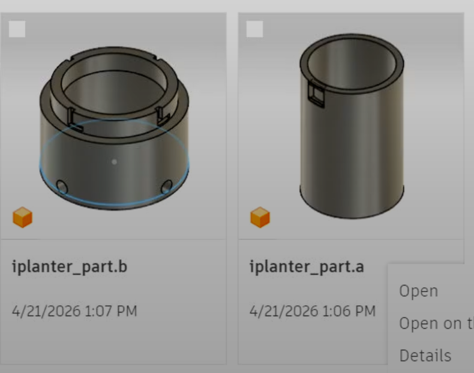
_this part was relatively easier hehe_

Next I went on to draw the enclosures for wires from the display to the pcb:
But, I ended it halfway cause it was close to midnight


### Recording Links

- https://lookout.hackclub.com/api/media/0d29021f-e4d3-4daf-aa5a-1558b102a603/video.mp4

## Entry 13
- ID: 3083
- Author: vivacious_eye
- Created At: 2026-04-20T18:26:46Z

### Content

**day_13**
It was interesting this day.
After finishing my wire holes from yesterday:

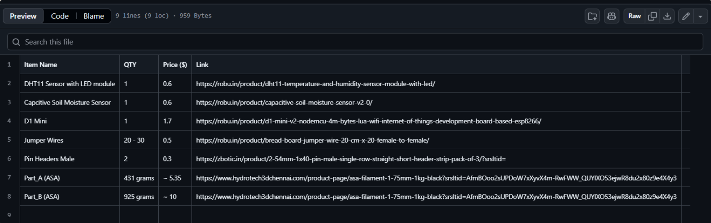


I started by adding some _consstraints_ to the pcb board and the display, _it was very tedious (cause I didn't how most of it workes):_

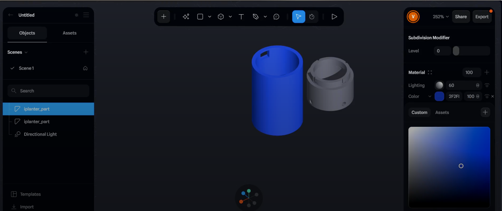
_this was for the display cause I didn't wanna mess around with screws :))_


_like so for the pcb_

Then I started to add copper tracks for all my connections in KiCAD:


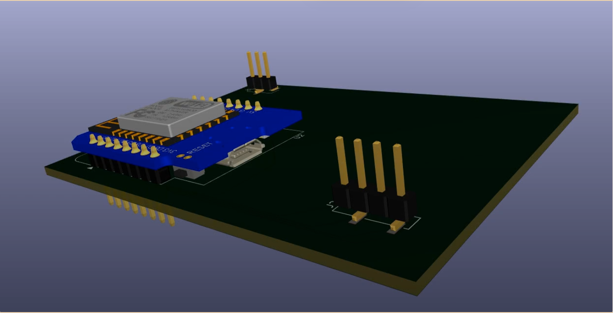
_it was oddly satisfying_

I also imported and added footprint for the male headers needed for the _soil moisture sensor_:

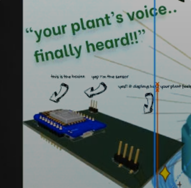

It also rendered in the 3d view yayyyy!!

After that I ended my session by updating the _git repo_


### Recording Links

- https://lookout.hackclub.com/api/media/4732f08f-7ea3-4eb7-bfe2-8156e80a7cf4/video.mp4

## Entry 14
- ID: 3237
- Author: vivacious_eye
- Created At: 2026-04-21T17:04:08Z

### Content

**day_13**
_Yoo it was soo motivating for me todayy!!_

I first started by making to separate parts of my CAD design, One called _part a_ and another caled _part b_

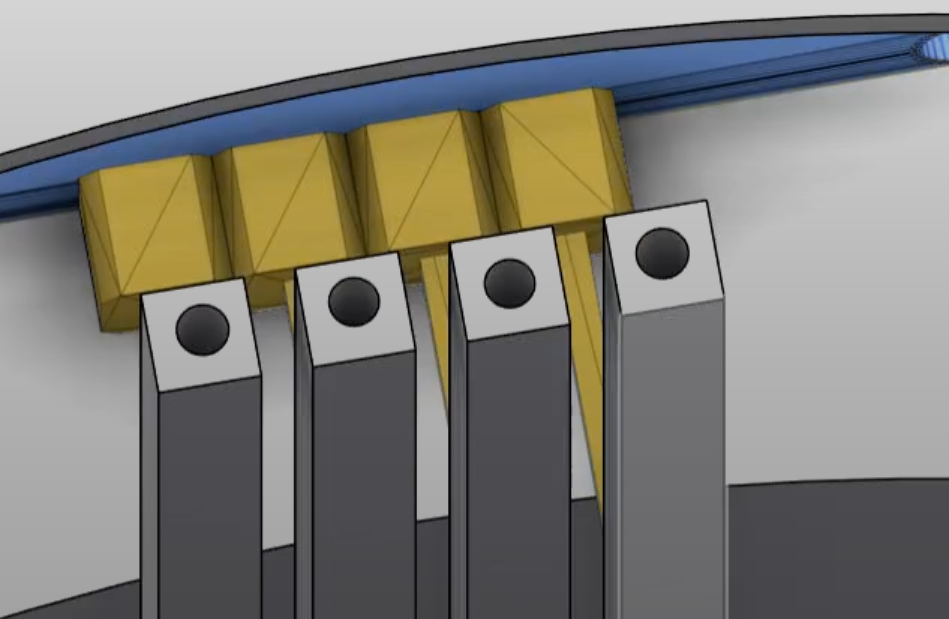
_this way it was easier to upload and store it in my repository_

Then I edited my BOM file to match the changes I made in my project
 
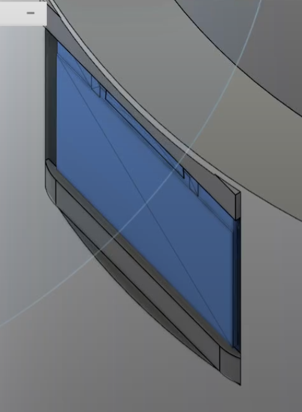
_I could still see ways to improve it_

After that I started to edit my zine page. For that I had to do these things:

> First I had to add colors to the CAD, so I imported the designs into spline to color them accordingly:

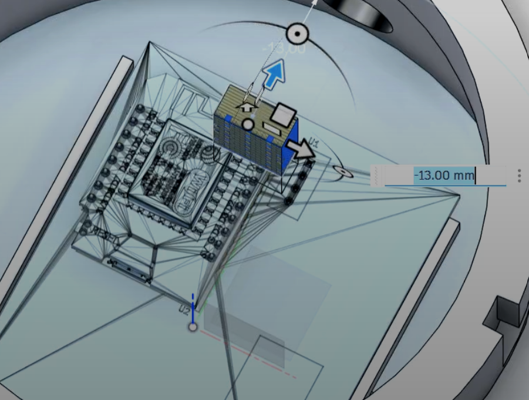
_it was easier to color in spline and also I had used it before soo..._

>Next I had to make changes into the zine page. I started by importing colored designs into the poster (png)

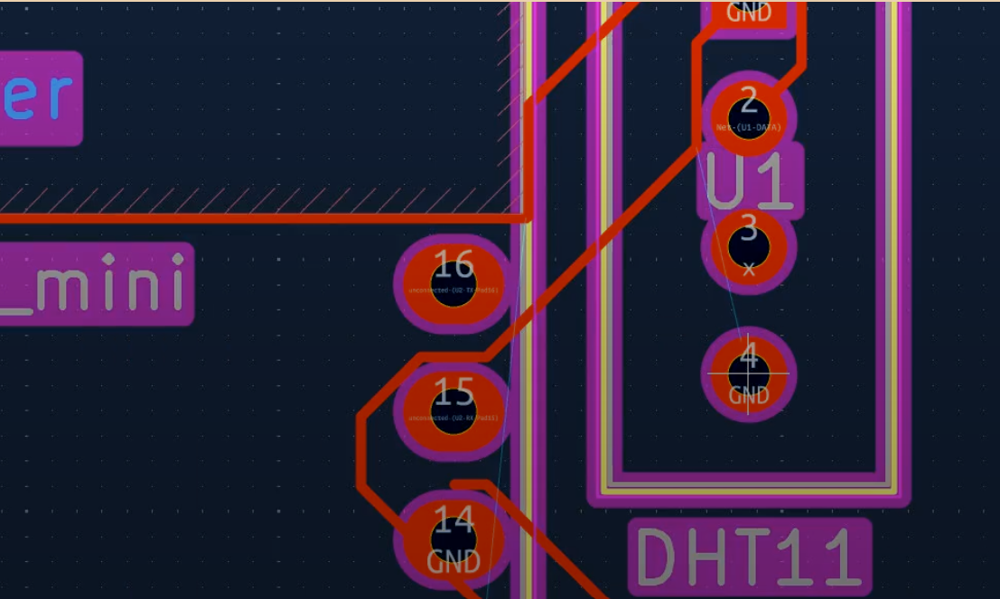

------

Midway I changed to another task I had to do. I had to add the male pin headers to the pcb cause the moisture sensor didn't have mounting pins like other components instead it had 3 female pins so I added 3 male pins to the pcb (as I should).


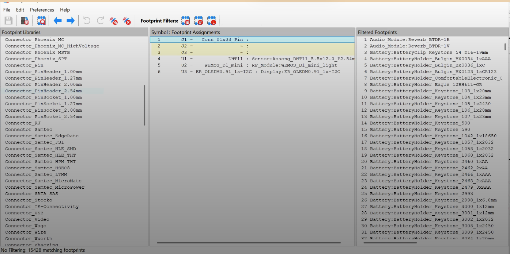
_I also had added 4 pins for the display cause it was not gonna be on the pcb but on the pot instead_

------
>Next, I imported the png of my edited pcb into the poster and aligned it according to the previous arrow marks I had used to label the pcb.


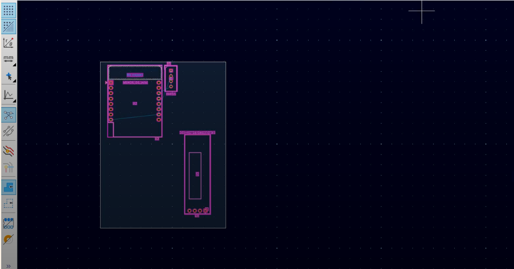
_this part required slightly more effort than other_

After this I uploaded everything to my git repo and ended my session!!

### Recording Links

- https://lookout.hackclub.com/api/media/a2de388d-6fdd-4200-bf0a-34a21ca7cad1/video.mp4

## Entry 15
- ID: 3416
- Author: vivacious_eye
- Created At: 2026-04-22T17:15:58Z

### Content

**day_14**
okay today went like this:
I first adjusted the parts and made sure whether they fit together or not in _Fusion_. For that I had to do some compliacted placemenst and had to activate components and blah blah.

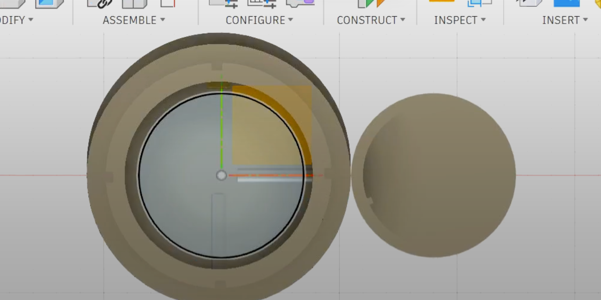
_it turned out pretty tall and nice_

Next I started to color the components I wanted to:
The display
The pcb
The wire encasings
Rest of the bodies.

_I imported the image of the pcb and the whole assembly into seperate bodies and captured them as images.._
After that I pasted my new designs into my poster and labeled the pcb and in the end it turned out to be like this:

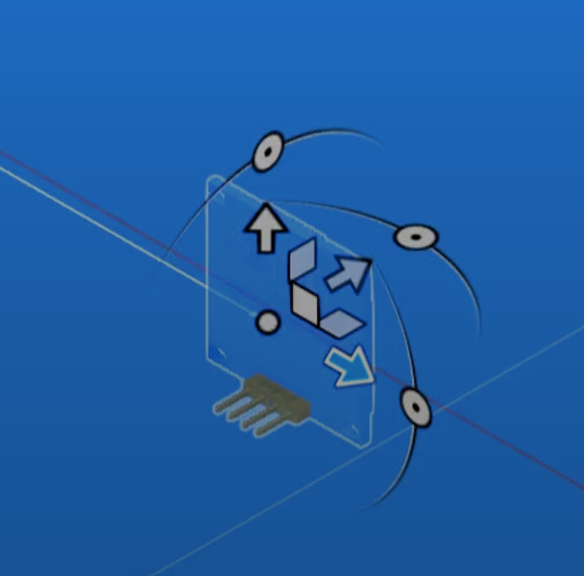
_it looks so better than the first draft_

The end -- (idk what to write :))


### Recording Links

- https://lookout.hackclub.com/api/media/0c9ae70b-0913-4697-a8e3-47e122c2646b/video.mp4

## Entry 16
- ID: 3709
- Author: vivacious_eye
- Created At: 2026-04-24T13:52:03Z

### Content

**day_14**
I started by redeisgning my zine page by inserting the newly made designs into them. I also made the _planter_ and the _pcb_ bigger cause everything around was on the spotlight whereas the two main things should be the ones in spotlight.
There was one piece of text that gave me a headache cause it wasnt visible enough. So, I tried putting a box behind it to make it more highlighted but it looked kinda crappy so i added some background blur to it and it was fixed
I also added a little fallout sticker at the bottom left.
I changed the sizes of some texts and I also changed the background to match it to a grassy calm aesthetic (I also added minecraft grass btw).
In the end it turned out like this:

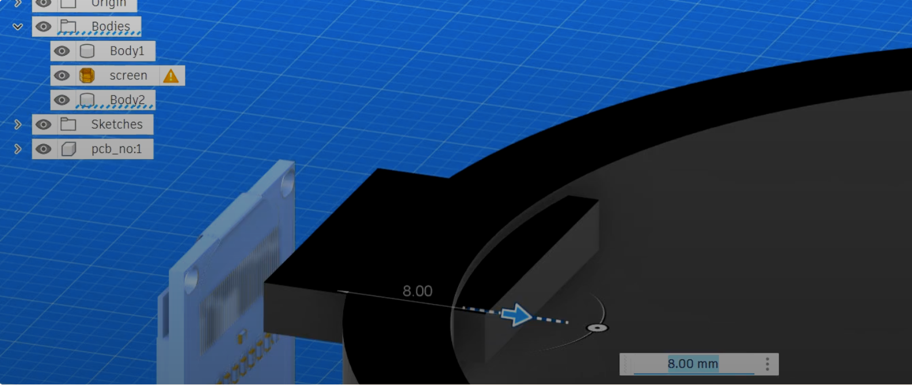

After that I had to do some changes in my README file:
I changed the pcb and planter photos to the new ones - 
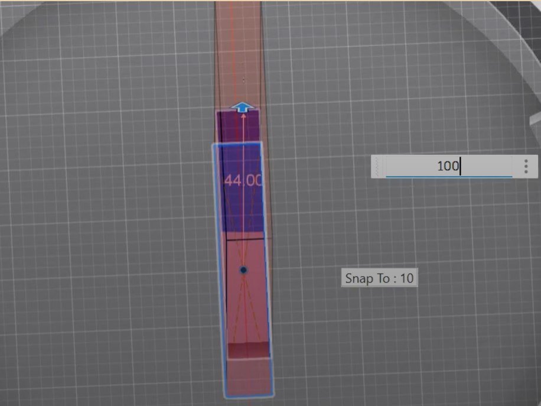
and
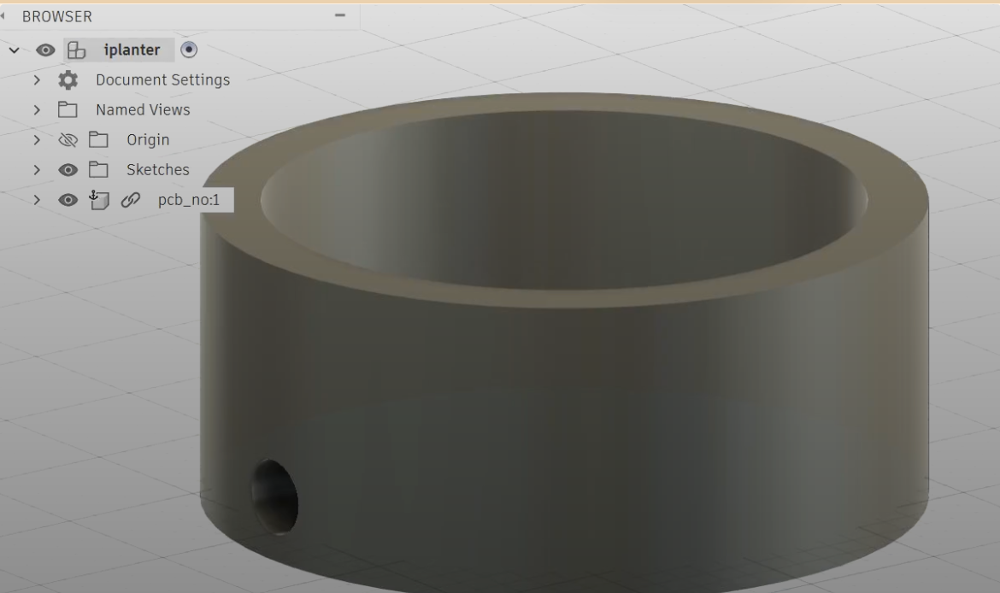

After that I had to edit some of the text like I had to put that it was made up of two parts and had a locking system.
Then, I tried to mess around in _fusion_ scouting for spots to put usb ports or a DC Jack.


### Recording Links

- https://lookout.hackclub.com/api/media/688f1e1e-0017-4471-87a2-eae8f582db90/video.mp4

## Entry 17
- ID: 3824
- Author: vivacious_eye
- Created At: 2026-04-25T05:47:46Z

### Content

**day_15**
I started where I left off yesterday that is by editing the README file:
I added a png of my zine page to the readme file - 
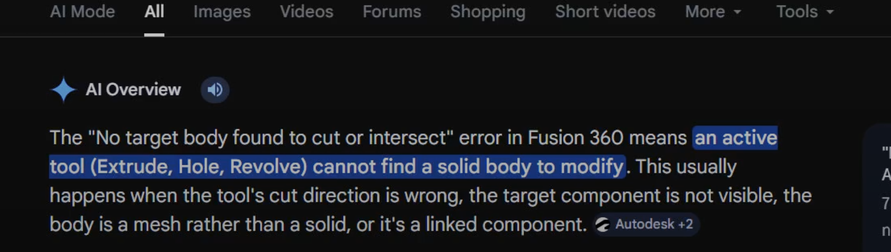

After that I started to cross check my repo against others'. I saw that others had saved the screenshots of their 3d model in a folder called assets. I thought I will fix them later and moved on to edit the 3d file:
I had to make the walls less thicker cause 10 mm was too much. So I scaled them down to 5mm (the walls). - 
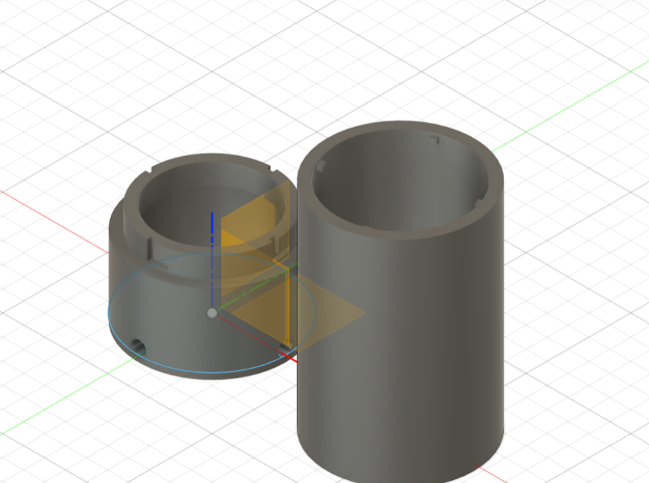

Next I had to change the size of the hole for the moisture sensor cause the hole's size had also scaled with the body:
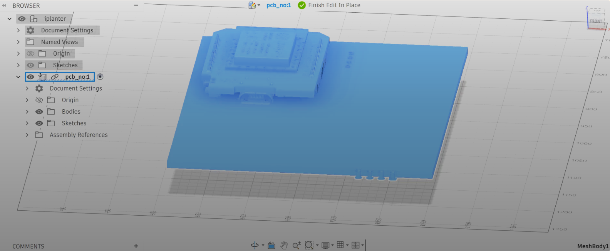

Then I researched for some time about rubber gaskets cause i had to use 1 or 2 in my project to stop the water from leaking in through the hole for the moisture sensor.
When I searched I found out that only metal gaskets could be simulated easily. Rubber gaskets needed complex setups and extensions.
I asked around in slack if complex modeling was required or a cylinder would do. The reply was like so:
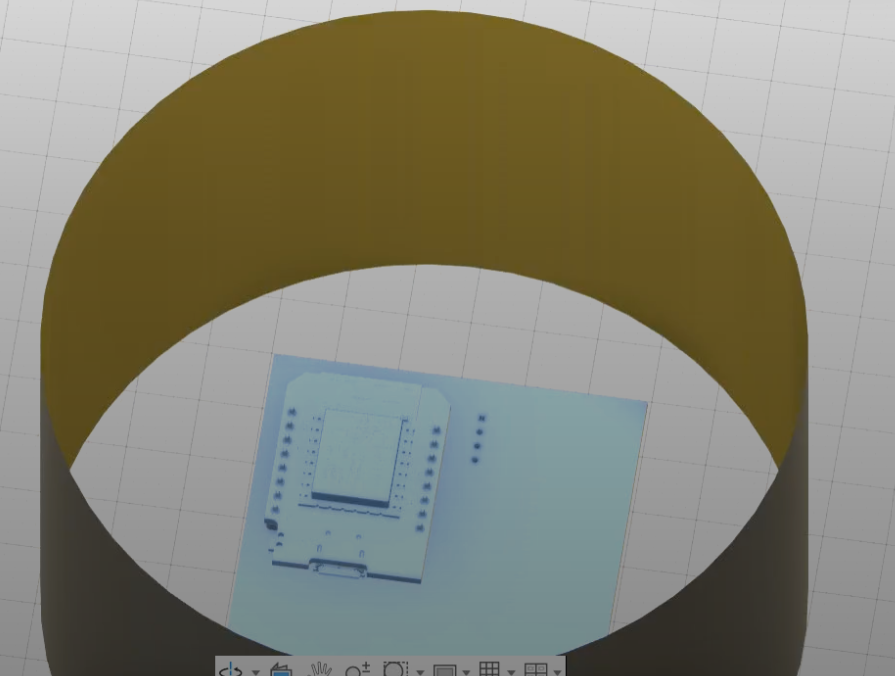
_I guess I can use a cylinder_

After that I wanted a _power suplly_ ryt? So, I added the barrel jack foortprint in my pcb and moved it over to the edge of the pcb so that it would peek out from the walls.
But, for whatever reason the kicad 3d file was not loading- 
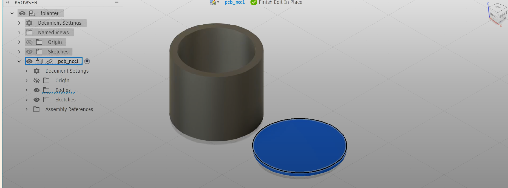

So, for the soln I imported a 3d file from online and it worked- 
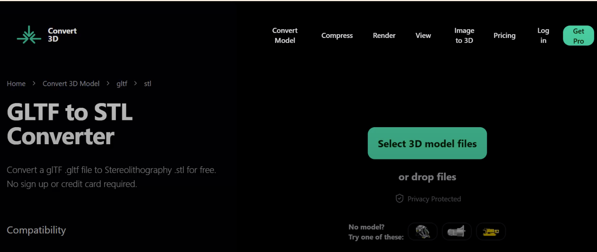

And then this time I chose the ryt library :
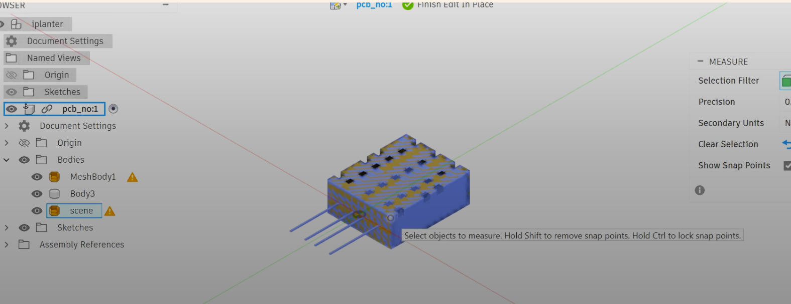

After I pulled the _barrel jack_ a lil' outside I was happy to find out that it _finally rendered._
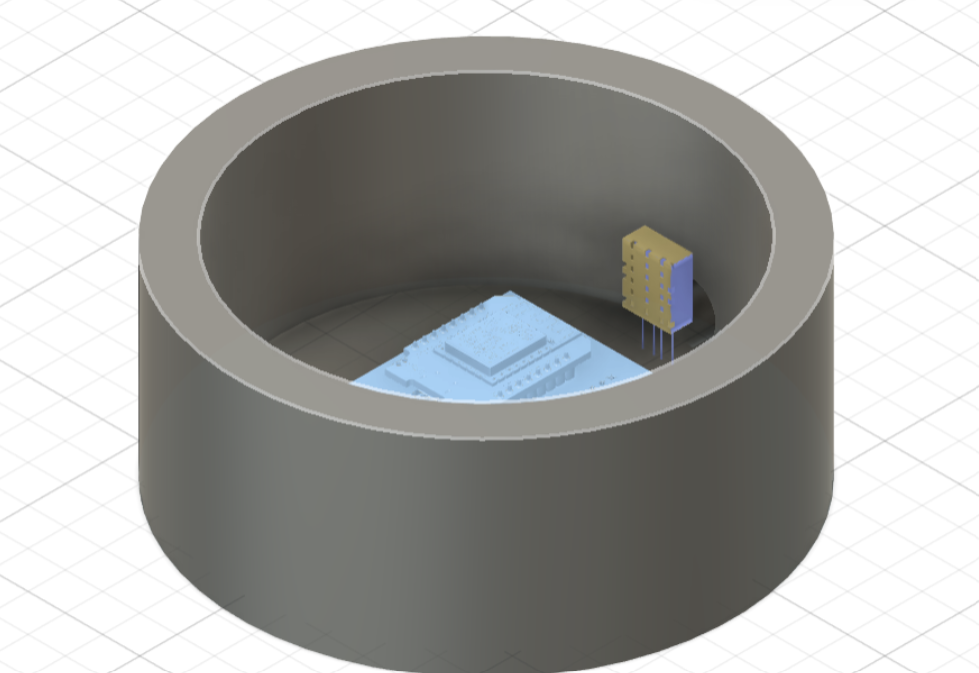
_I was so relieved.._

As I saw the pcb tracks it was a _mess_. I needed to find out a another way to connect pins to the _GND_ and _VCC_. 
So, then I came across **Filled Zones**. It was an efficient way to connect many pins to a single _power supply_ pin.
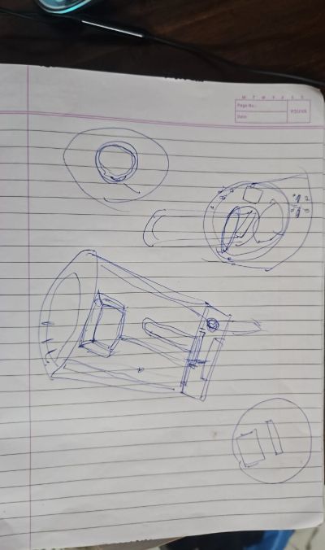
_as I was making them I came across another issue_

I realised that all these _SMT- pins had to be converted to _Through Holes_. SO after I did that I had two  zones:
1. GND
2. VCC
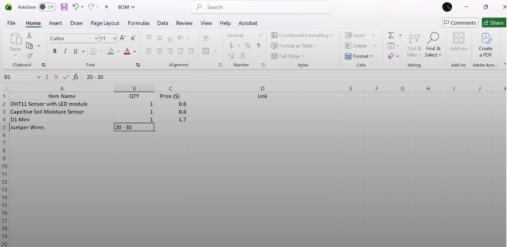

Then I went on to attach to a _recatngle_ to the _cylindrical surface_ of the part A (One that holds the PCB) so that the pcb edges werent exposed when I tried to bring out the barrel jack through a hole.
Then I imported the new pcb to Fusion and tried to work with it. I stopped halfway cause it was too late and ended my session..

### Recording Links

- https://lookout.hackclub.com/api/media/03b7322f-26b9-42cc-8047-c56269759760/video.mp4

## Entry 19
- ID: 4196
- Author: vivacious_eye
- Created At: 2026-04-27T06:49:12Z

### Content

**day_17**
### Adding Panel Mount and Routing Moisture Sensor through the parts
I first started by making a hole from which the whole pcb was visible so I could get _rough idea_ of how big the hole for the _barrel jack_ should be.
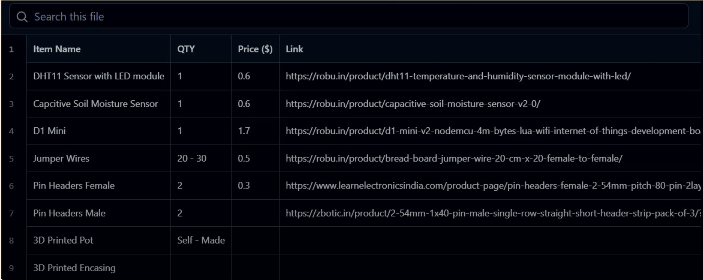

There were also some defects in the Part A that I fixed them- 
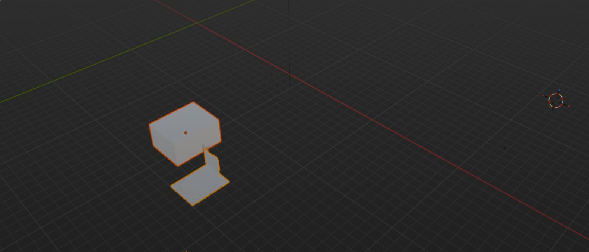

As I was doing smth ( Maybe messing around with emboss) I pressed something and _fusion crashed_. After that i lost my _whooleee progress_.

Next I had to do everything _from the start_.
I tried to make a _thin covering_ for the hole, when i tried to attach it I realised it was not curved but straight. Then I searched for some soln and found out that it has to be a curved sketch so I started drawing a curved _rectangle using arcs_. But, then also I didn't _feel satisfied_. So I finally settled for a _press - pulled hole_ for the _barrel jack._:


After that I took a look at the screen and realised that there was _nothing holding it in place_. So I made _holes_ to hold it.


Followed by it was designing a place for the _moisture sensor to go in_. I had had a _groundbreaking idea earlier today_. My plan was to route it from Part B, then there would be no _leakage, no complex encasing_. I just had to import a _case for the electronic components on it. I had _seen some on grabcad_. So, I chose and experimented with some and finally settled on one. I made a hole and saw it it fit and it was perfect. 

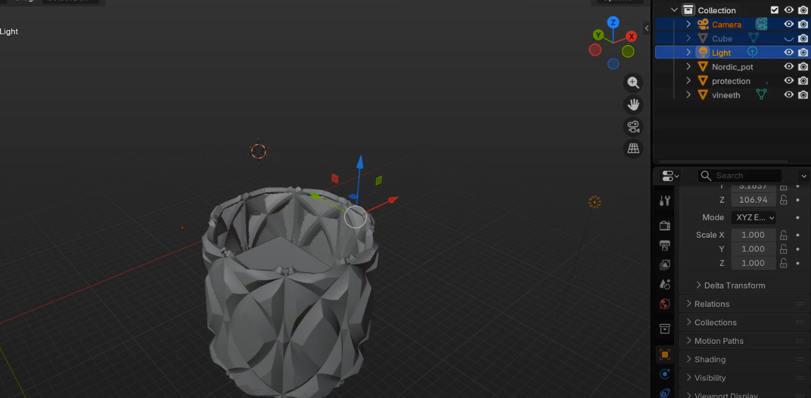
I left it here and closed for the day.


### Recording Links

- https://lookout.hackclub.com/api/media/b52d8ea6-4c21-4fc5-9a3d-2a394aab2168/video.mp4

## Entry 20
- ID: 4328
- Author: vivacious_eye
- Created At: 2026-04-28T08:03:43Z

### Content

**day_18**
### Fitting everything together and fixing the display
I wanted to see whether everything fit together or not (anyway I had to join them) soo I stated by aligning the two parts and joining them according to their mounts:
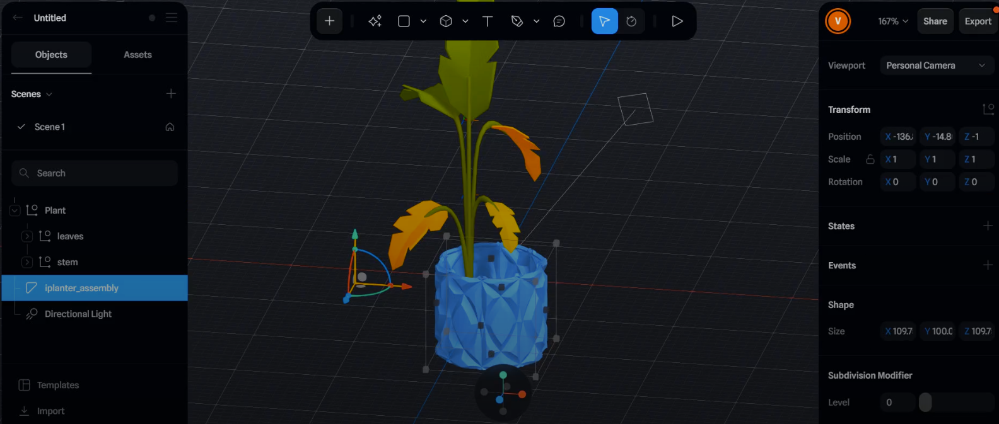
_this took a lot of time cause the parts were in different positions and angles so fitting them together was painstakingly hard_

Next I plugged in the moisture sensor with its cover (that I had found yesterday on grabcad) into the the hole that i had made in the part a - 

_this was easier to do cause i had alr struggled b4_

Then I had to make a hole in the part b for the wires of the moisture sensor to go in so used the other part of the cover (for the moisture sensor) that I was not using to cut the hole- 
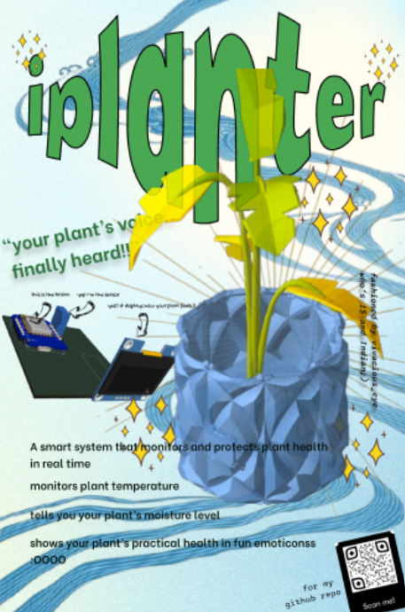

After that I shifted over to the display and started making circular standoffs for the screws to go into -
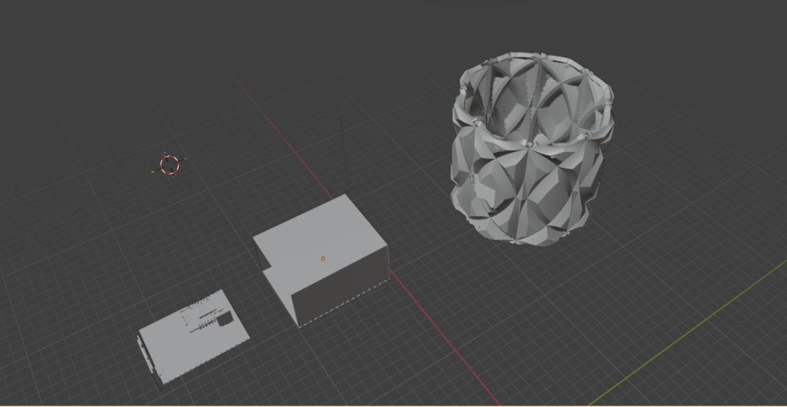
_thiss task wass verryyyy difficult,, annoying, irritating and every other synonyms you can think off_

After making the standoffs I thought it was messy and I tought of adding a small panel behind the screen.
So, I did that by embossing a small rectangle below the screen and extruding it to the upper part.
As I was making  small hole for the cables to come out the hole wasn't _see through_!! I thought _"well, that's wierd" -
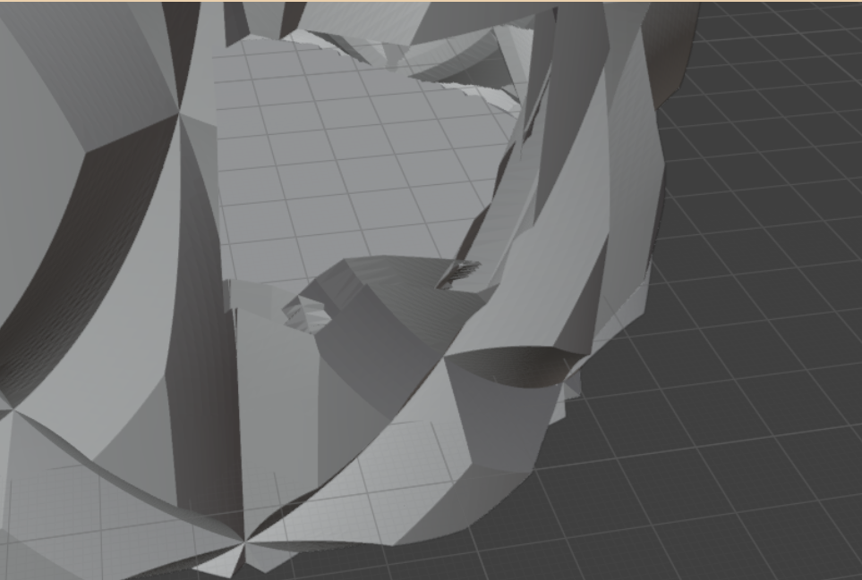

So, I thought I can make a rectangle and emboss it on the panel to make a hole. - 
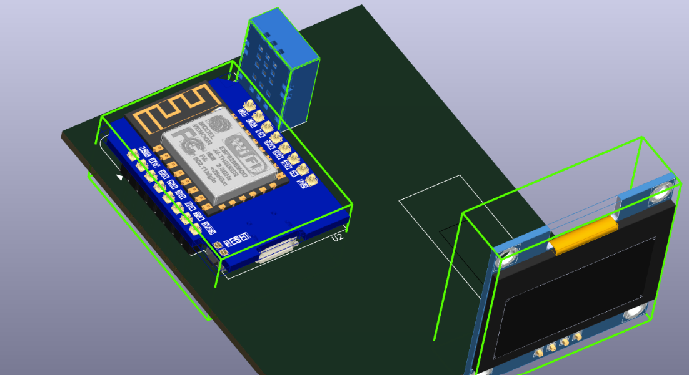

Again!1 It looked _veryyy ugly_ SO, I decided I would some type of adhesive to stick it and finally ended my session (more like struggle).

### Recording Links

- https://lookout.hackclub.com/api/media/80d7eabc-8b86-4ef7-b661-f2eea82c9321/video.mp4

## Entry 21
- ID: 4446
- Author: vivacious_eye
- Created At: 2026-04-29T04:55:14Z

### Content

**day_19**
### Updating My Repository
Today was the _Redemption_ day. 
Today I uploaded all my new files into my repo.
I was using another guy's repo as a reference. So, I started by adding the photos of 3d models like - top. bottom, rear etc. I also uploaded images of pcb. - 
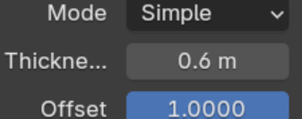

Next I had to upload the whole assembly as a step file and individual parts as stl (even the pcb). So, I did that -  
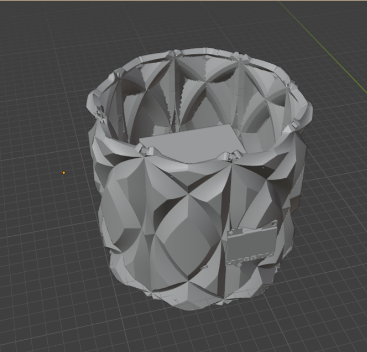

Next I uploaded all the KiCAD files to a file called _KICAD_. I also had uploaded the gerbers files in a zip folder in _Production_ folder later. I made a folder called _Firmware_ and put my main code into it.
I also made changes to the BOM and zine page like fixing prices and quantity, also adding the new parts in BOM and adding a new picture of the new assembly in zine. 
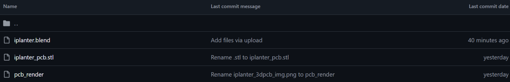

Next I made changes to the _README_ file like removing the mentions of emotions cause I hadn't really added code for that. And adding another part to the product structure, mentioning in the note section (that I had created newly) that the display was held together with adhesive. And updating the readme with new images altogether.

When I was editing the BOM I had to check the weight of the plastic components ryt? SO, as I checked them I got _ASTONISHES, FLABBERGASTED, EARTHSHATTERRED_ cause the weight of the part a alone was over 9kg. I really was like "what the hell!!". Then I stopped recording for a bit and asked my _dad_ for a bit then uderstood that I had to change the physical material to plastic which was steel. After that also I reduced edge thickness on the safer side.- 
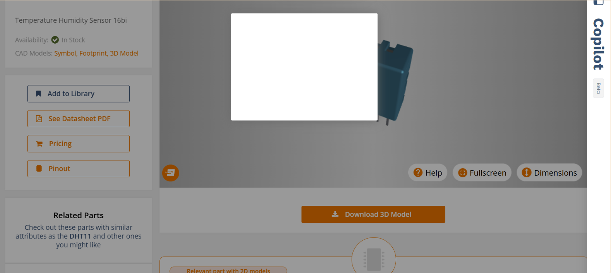

After calculating all the money for the parts the total was only around 11 dollars. And at end this is how my repo looks like: 
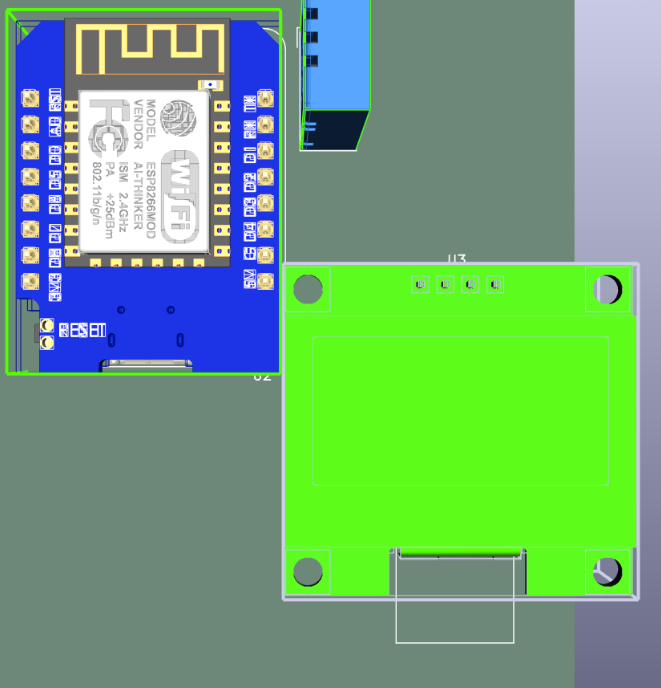


### Recording Links

- https://lookout.hackclub.com/api/media/01673cf9-93a3-456b-bc8c-024d6964afca/video.mp4

## Entry 22
- ID: 6109
- Author: vivacious_eye
- Created At: 2026-05-08T16:38:15Z

### Content

**day_8**
### Getting ready for resubmission 
It hapenned, my project got **returned**. (┬┬﹏┬┬). But, ik it was gonna happen and it turned out to be far better than I thought. 
I first improved on my **CAD**. I fixed the screen and added **M2 Heat - Inserts to it**. And instead of the different channels for the OLED wires. I made one **single channel **that houses all the wires.
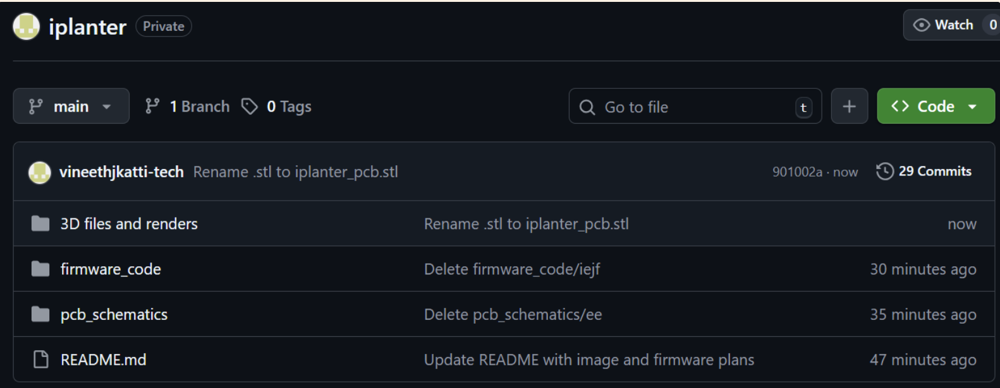
_I had faced a problem at first - The component was getting scaled down when I deleted one of its parts so I just hid those parts lol_

After that I updated the repo and added a 3d model of the screws and inserts I had used _just in case_.
I also edited the README to include the **voltage details of the barrel jack** and brought the zine section to the top and enlarged the photo!
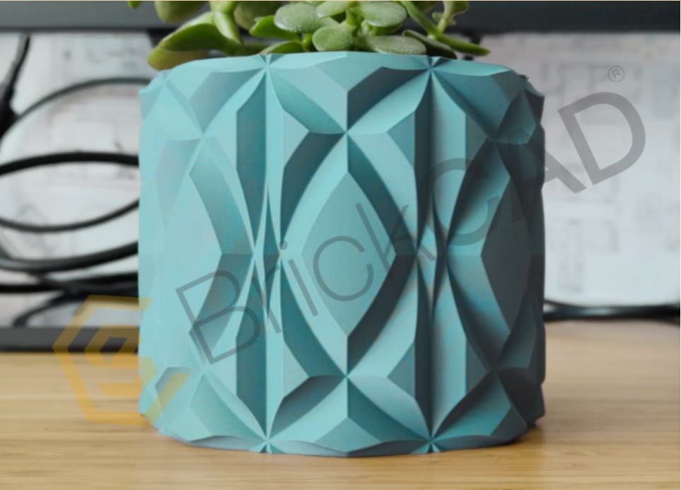

-------
I took a lot of time and I was extra careful so that my project doesn't get returned again.

### Recording Links

- https://lookout.hackclub.com/api/media/86f3cf26-08f5-4a27-b349-2f745497568b/video.mp4
- https://lookout.hackclub.com/api/media/200e538f-32c4-468b-a43e-9686d0a14264/video.mp4

## Entry 23
- ID: 6237
- Author: vivacious_eye
- Created At: 2026-05-09T10:51:20Z

### Content

**day_21**
### Final Polish
Ik the recording is _very_ short but I had to journal this cause I'm about to resubmit my project.
I update the _Assembly.step_ and also added the updated version of part a to my repo.
I had to polish the area near the screen first so I did that. 
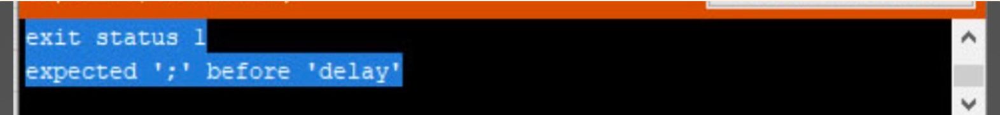
I'm going to **resubmittt!!**
---------------
### WISH ME LUCK READER!!

### Recording Links

- https://lookout.hackclub.com/api/media/0c49f766-ea7c-4edd-8c59-523e63b382ec/video.mp4

## Entry 24
- ID: 6740
- Author: vivacious_eye
- Created At: 2026-05-12T08:45:09Z

### Content

**day_22**
### Re:Zero
(┬┬﹏┬┬)(┬┬﹏┬┬)(┬┬﹏┬┬) It got **returned** **YET AGAIN!!**
But, this time I had _less _errors and I knew how I was gonna go about to fix them.
There were 3 mistakes:
> The zine page was too cluttered .
> Zine page had contrast issues
> BOM didn't have a Total ( I swear there was a total there!! ) 

I first tackled the **zine page**. I made some **opacity** changes and positioned **high contrast** texts (bold, black) with **low contrast bg** (white, low opacity). I also **resized** many items like I made the **planter **and the **pcb **larger than the **heading **and **moved **the **info **a lil down. Also I had to change the **QR **and make it **bigger **according to the reviewer. Here is the final result:
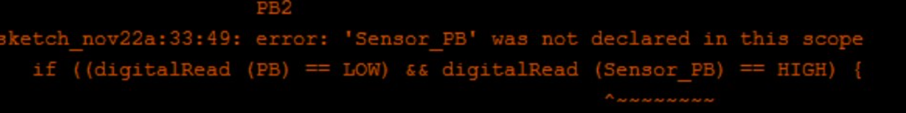


Next I went for the BOM. I tried to understand what he meant. Like was he really pointing out the total or it was just an excuse for a **bigger problem**? _gotta become a detective to get your project approved **=P**. 
And then I realised I had to add **shipping costs.** So, I went on the internet and found that **general cargo** (flight) takes around 4 to 8 dollars per kg. As my project was **less than a kg** I put **10 dollars** in for the shipping costs and finally put the grand total. 
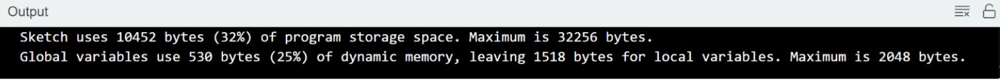


### Recording Links

- https://lookout.hackclub.com/api/media/815ca600-27fb-43a9-90ad-d8b02d48aac5/video.mp4

## Entry 25
- ID: 8464
- Author: vivacious_eye
- Created At: 2026-05-22T12:46:01Z

### Content

**day_23**
# Fixing issues with the CAD files and the PCB
My project got returned again for some issues with the CAD and PCB files. The main issues were as such:
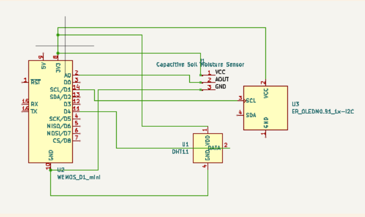

I first started by correcting the problem with filled zones - I had put two filled zones in the same layer. Such a silly and dangerous mistake! I put the filled zones in separate layers and also rotated the D1 Mini so that its USB port was properly accessible.
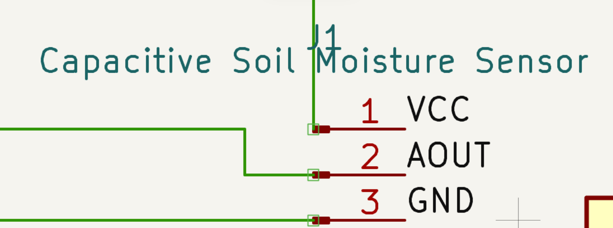


I checked what he meant by "the two parts are disconnected". Then I found out there was no overlap between the Part A and the Bayonet Mount Rim. So, I increased the rim thickness.
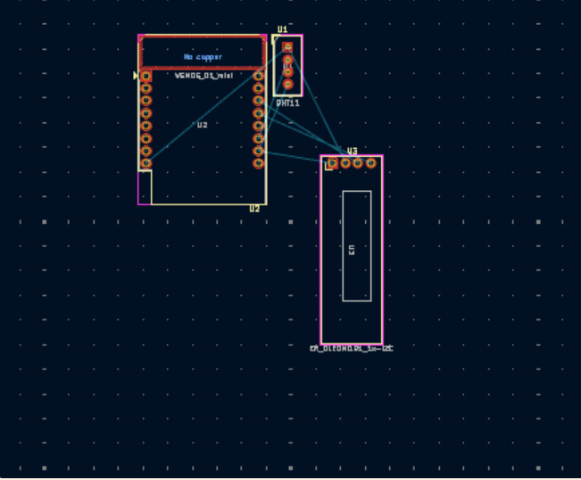

Next as he said, the moisture sensor was clipping into the bottom of the Part B and was never gonna measure the moisture levels if it was left unnoticed. So I shifted the hole for it a little upwards. 
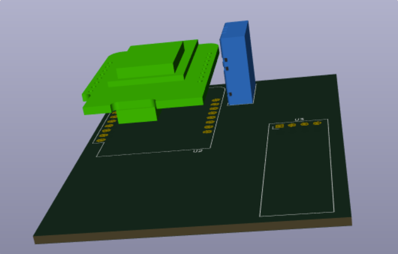

I next took a look at the mount and found out the pin of Part B never really poked inside the L shaped depression. So, what I did was I made the pins longer so that they properly locked together.

Next I committed all the to github. This was a real pain especially cause I had chosen to upload both .stl and . step versions of all parts.
I also re uploaded the pcb (both in the assembly and individually) cause i had inserted the dht11 model too.

After that I also had to change the photos of the PCB in the Asset's page due to the newly added component model.


### Recording Links

- https://lookout.hackclub.com/api/media/32767433-f410-4cd4-a7dd-5e8493e4f3a6/video.mp4

## Entry 26
- ID: 11381
- Author: vivacious_eye
- Created At: 2026-06-03T14:09:40Z

### Content

**day_24**
# Connecting the PCB and refining the zine page'

I had been informed to add **some type of locks** to connect the PCB to the Part A. So, I figured, the easiest was to introduce **clip-locks** on the fours sides of the PCB. 

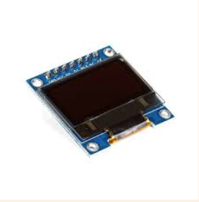

I made 4 locks on all four sides with just enough clearance to lock-in and not not come out. I had made sure tht the locks **didn't touch** any of the components. So, I was in the **green.**

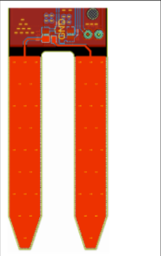
_I'm kinda doubting this will pass_

Next, I was told to **improve my zine** and take inspiration form hackclub magazine. I first **decluterred** the page by removing all the sparkles and **"extras"** that were on the poster. Then I **repositioned** the text over to the right and shifted all the images to left in a vertical order. I changed the primary font of the page to **Micro 5** cause us somewhat resembled minecraft font.
It looked really good now. I replaced the old fallout banner with the new hackclub banner which looked cool.
I also shifted all the objects so that they didn't go out of the printing area.

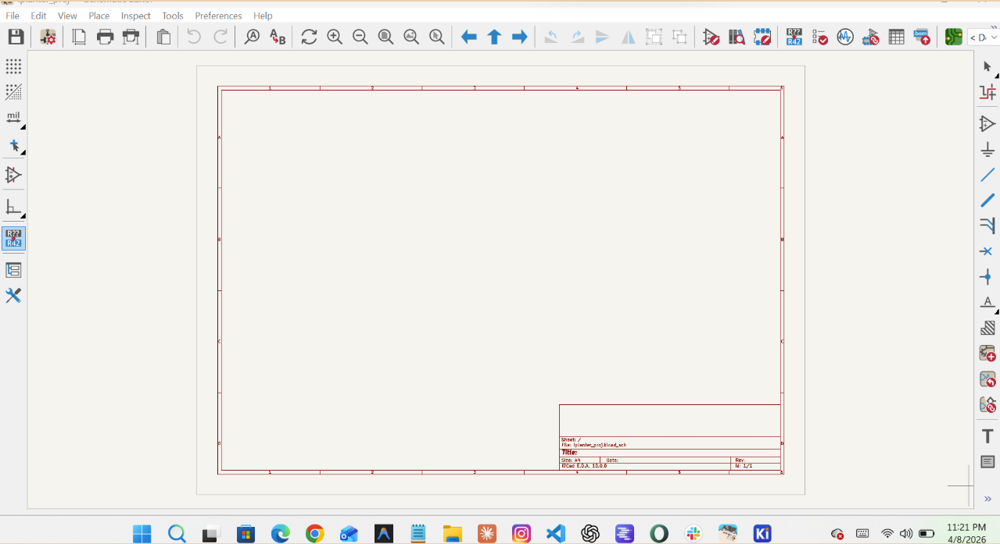


### Recording Links

- https://lookout.hackclub.com/api/media/6521b74d-b1e7-4148-a941-ddb9a29554ac/video.mp4
- https://lookout.hackclub.com/api/media/7e7aac77-6517-4b5f-8983-70b98b5147fb/video.mp4

## Entry 27
- ID: 14026
- Author: vivacious_eye
- Created At: 2026-06-14T17:04:08Z

### Content

**day_25**
# Adding Holes to the PCB and Connecting it to the Body
It was returned mainly cause the PCB had to be connected with 4 screws which I hadn't done before. 

So, I started by adding holes to the PCB. But, it flashed to me that **someone had said that my pcb was too big**. I thought-- ehh, **never a better time to fix it and also more hours.** Soooooo, I made my PCB more **compact and budget friendly**. 

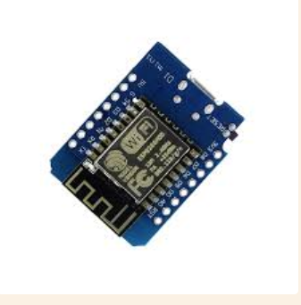

So, after this I added the holes and uploaded it to fusion. 
In Fusion I postioned the PCB and aligned it to the hole for the power supply.
I looked for **self-tap screws** online and used those in my project. I also added a **groove** under the PCB so that the screws dont conflict with the pins on the underside.

--------------------

I also edited the zine page a lil to make it more **readable and distinguished.**


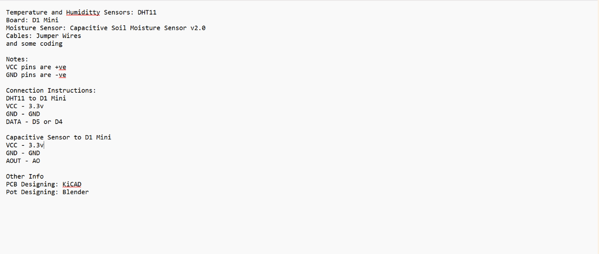


### Recording Links

- https://lookout.hackclub.com/api/media/e57b4522-ed95-43bb-bf74-7ba9bb4ac293/video.mp4
- https://lookout.hackclub.com/api/media/58336c67-600d-42a3-9d92-4480a5b43881/video.mp4

## Entry 28
- ID: 14568
- Author: vivacious_eye
- Created At: 2026-06-16T16:47:28Z

### Content

**day_26**
# Improving Zine and Updating Repo

I improved a lot of things in my zine today. The end result is very veryyyy good (according to me that is but I have also received some what positive review on slack).

------------------

The zine had also been pointed out to be improved. First thing I did was to get **some reviews**. I posted it on slack to get reviews and people told me:

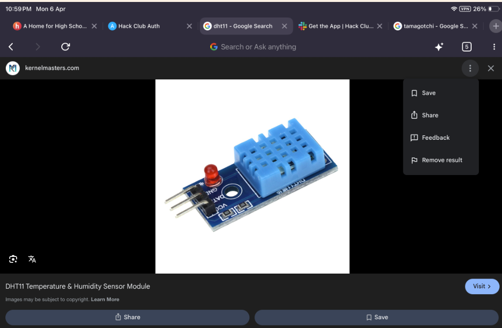


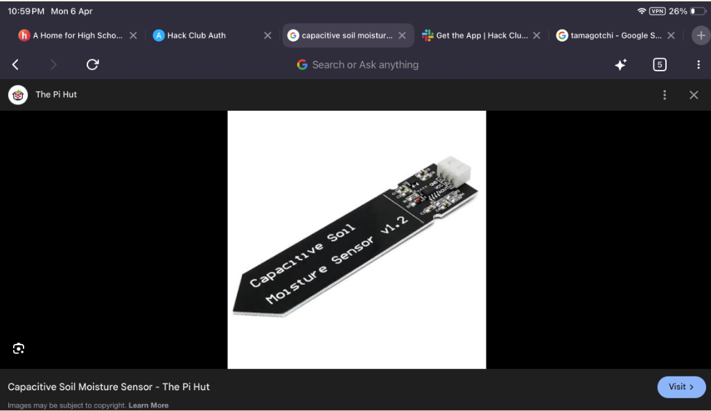

--------------------------

So, here is what I did. I first of all removed the **plain photos** of the planter and pcb (apparently the planter looked like a "_cylinder_"). Then I opened fusion.

In fusion I kind of like **exploded** all the parts and then rendered it. It had this awsome **exploded like look** now:

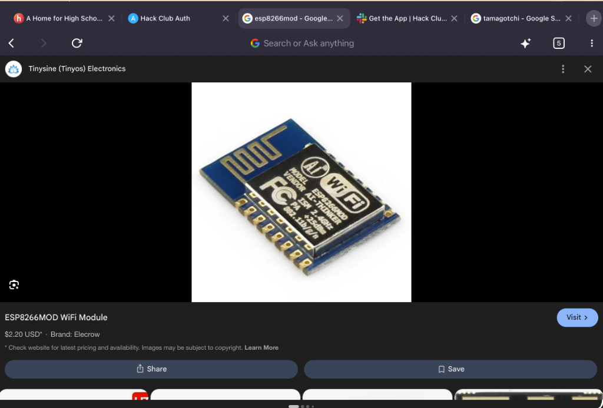

I uploaded this to figma.
Followed by this was **deleting all unwanted texts** and positioning the main lines properly while also making space for the new image of the iplanter.  I added arrow marks for the individual components, labelled them.
After that I had to do a hella lot of **positioning** to make the image blend with the rest of the elements.

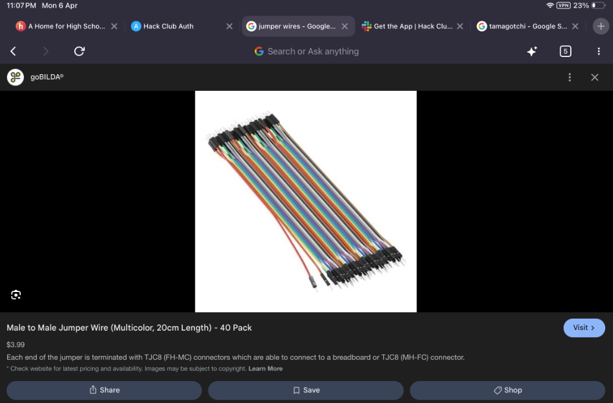

At last I did the boring stuff and uploaded the latest vrsion of zine to my repo. I also double checked every file of CAD to make sure it was the latest one. I did a lot of new refinments and updates to the README too!!

### Recording Links

- https://lookout.hackclub.com/api/media/2ebc86fb-2988-40f1-8d9e-0c735e4f75d8/video.mp4
- https://lookout.hackclub.com/api/media/d375ea5b-6b0c-4839-9f35-30c2da5703dc/video.mp4
